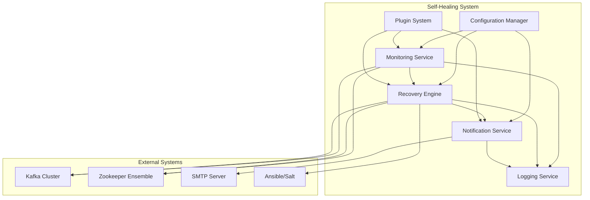

# Design Document

## Overview

The Kafka Cluster Node Self-Healing Automation system is designed as a modular, event-driven Python application that continuously monitors Kafka brokers and Zookeeper nodes, automatically executes recovery procedures when failures are detected, and provides comprehensive logging and notification capabilities.

The system follows a plugin-based architecture to ensure extensibility and maintainability, with clear separation of concerns between monitoring, recovery, and notification subsystems.

## Architecture

### High-Level Architecture



### Core Components

1. **Configuration Manager**: Centralized configuration loading and validation
2. **Monitoring Service**: Health check orchestration and failure detection
3. **Recovery Engine**: Automated recovery action execution with retry logic
4. **Notification Service**: Alert generation and delivery management
5. **Logging Service**: Comprehensive audit trail and log management
6. **Plugin System**: Extensible framework for custom monitoring, recovery, and notification modules

## Components and Interfaces

### Configuration Manager

**Purpose**: Load, validate, and provide configuration data to all system components.

**Key Classes**:
- `ConfigurationManager`: Main configuration handler
- `ClusterConfig`: Kafka/Zookeeper cluster topology
- `RetryPolicy`: Recovery retry configuration
- `NotificationConfig`: Email and alert settings

**Interface**:
```python
class ConfigurationManager:
    def load_config(self, config_path: str) -> Dict[str, Any]
    def validate_config(self, config: Dict[str, Any]) -> bool
    def get_cluster_config(self) -> ClusterConfig
    def get_retry_policy(self) -> RetryPolicy
    def get_notification_config(self) -> NotificationConfig
```

### Monitoring Service

**Purpose**: Orchestrate health checks across all configured nodes and detect failures.

**Key Classes**:
- `MonitoringService`: Main monitoring orchestrator
- `HealthChecker`: Individual node health check execution
- `NodeStatus`: Health status representation
- `FailureDetector`: Failure pattern analysis

**Interface**:
```python
class MonitoringService:
    def start_monitoring(self) -> None
    def stop_monitoring(self) -> None
    def check_node_health(self, node: NodeConfig) -> NodeStatus
    def register_failure_callback(self, callback: Callable) -> None
```

**Monitoring Methods**:
- **JMX Monitoring**: Connect to Kafka broker JMX endpoints for metrics
- **REST API Monitoring**: Use Kafka REST Proxy for cluster state
- **Socket Monitoring**: Direct TCP connection tests to broker ports
- **CLI Monitoring**: Execute kafka-broker-api-versions.sh and similar tools
- **Zookeeper Monitoring**: Use Zookeeper four-letter words (ruok, stat)

### Recovery Engine

**Purpose**: Execute automated recovery procedures with configurable retry logic.

**Key Classes**:
- `RecoveryEngine`: Main recovery orchestrator
- `RecoveryAction`: Individual recovery action execution
- `RetryManager`: Retry logic and backoff handling
- `RecoveryResult`: Recovery attempt outcome

**Interface**:
```python
class RecoveryEngine:
    def execute_recovery(self, node: NodeConfig, failure_type: str) -> RecoveryResult
    def register_recovery_action(self, action_type: str, action: RecoveryAction) -> None
    def get_recovery_history(self, node: NodeConfig) -> List[RecoveryResult]
```

**Recovery Actions**:
- **Service Restart**: systemctl restart kafka/zookeeper
- **Process Kill/Restart**: Kill hung processes and restart
- **Data Cleanup**: Clear temporary files and logs
- **Ansible Playbook**: Execute predefined Ansible recovery playbooks
- **Salt Command**: Execute Salt state or command modules
- **Custom Scripts**: Run user-defined shell scripts

### Notification Service

**Purpose**: Generate and deliver alerts when automated recovery fails.

**Key Classes**:
- `NotificationService`: Main notification orchestrator
- `EmailNotifier`: SMTP-based email notifications
- `NotificationTemplate`: Email content generation
- `DeliveryQueue`: Notification retry and queuing

**Interface**:
```python
class NotificationService:
    def send_failure_alert(self, node: NodeConfig, recovery_history: List[RecoveryResult]) -> None
    def send_recovery_confirmation(self, node: NodeConfig) -> None
    def register_notifier(self, notifier_type: str, notifier: Notifier) -> None
```

### Logging Service

**Purpose**: Provide comprehensive audit trails and structured logging.

**Key Classes**:
- `LoggingService`: Centralized logging management
- `AuditLogger`: Structured audit trail logging
- `LogRotator`: Log file rotation and archival

**Interface**:
```python
class LoggingService:
    def log_monitoring_event(self, node: NodeConfig, status: NodeStatus) -> None
    def log_recovery_action(self, node: NodeConfig, action: str, result: RecoveryResult) -> None
    def log_notification_event(self, notification_type: str, recipient: str, status: str) -> None
```

### Plugin System

**Purpose**: Enable extensible monitoring, recovery, and notification capabilities.

**Key Classes**:
- `PluginManager`: Plugin discovery and lifecycle management
- `MonitoringPlugin`: Base class for monitoring plugins
- `RecoveryPlugin`: Base class for recovery plugins
- `NotificationPlugin`: Base class for notification plugins

**Interface**:
```python
class PluginManager:
    def load_plugins(self, plugin_dir: str) -> None
    def get_monitoring_plugins(self) -> List[MonitoringPlugin]
    def get_recovery_plugins(self) -> List[RecoveryPlugin]
    def get_notification_plugins(self) -> List[NotificationPlugin]
```

## Data Models

### Node Configuration
```python
@dataclass
class NodeConfig:
    node_id: str
    node_type: str  # 'kafka_broker' or 'zookeeper'
    host: str
    port: int
    jmx_port: Optional[int]
    monitoring_methods: List[str]
    recovery_actions: List[str]
    retry_policy: RetryPolicy
```

### Node Status
```python
@dataclass
class NodeStatus:
    node_id: str
    is_healthy: bool
    last_check_time: datetime
    response_time_ms: float
    error_message: Optional[str]
    monitoring_method: str
```

### Recovery Result
```python
@dataclass
class RecoveryResult:
    node_id: str
    action_type: str
    command_executed: str
    exit_code: int
    stdout: str
    stderr: str
    execution_time: datetime
    success: bool
```

### Retry Policy
```python
@dataclass
class RetryPolicy:
    max_attempts: int
    initial_delay_seconds: int
    backoff_multiplier: float
    max_delay_seconds: int
```

## Error Handling

### Monitoring Errors
- **Network Timeouts**: Log timeout and continue with next node
- **Authentication Failures**: Log security error and skip node until configuration is fixed
- **Invalid Responses**: Log parsing error and try alternative monitoring method
- **Plugin Failures**: Log plugin error and continue with built-in monitoring methods

### Recovery Errors
- **Command Execution Failures**: Log failure details and proceed with next retry attempt
- **Permission Errors**: Log security error and escalate to notification immediately
- **Resource Constraints**: Log resource error and implement exponential backoff
- **Plugin Failures**: Log plugin error and try built-in recovery methods

### Notification Errors
- **SMTP Connection Failures**: Queue notifications for retry with exponential backoff
- **Authentication Failures**: Log error and attempt with backup SMTP configuration
- **Message Formatting Errors**: Log error and send simplified notification
- **Plugin Failures**: Log plugin error and use built-in email notification

### System Resilience
- **Configuration Errors**: Fail fast on startup with clear error messages
- **Memory Constraints**: Implement memory monitoring and cleanup of old logs/history
- **Disk Space Issues**: Implement log rotation and cleanup procedures
- **Unexpected Exceptions**: Log full stack trace and continue operation where possible

## Testing Strategy

### Unit Testing
- **Component Isolation**: Mock external dependencies (Kafka, Zookeeper, SMTP)
- **Configuration Validation**: Test all configuration scenarios and error cases
- **Plugin System**: Test plugin loading, validation, and error handling
- **Retry Logic**: Test exponential backoff and maximum attempt limits
- **Data Models**: Test serialization, validation, and edge cases

### Integration Testing
- **End-to-End Workflows**: Test complete monitoring → recovery → notification flows
- **External System Integration**: Test against real Kafka/Zookeeper instances
- **Plugin Integration**: Test with sample monitoring, recovery, and notification plugins
- **Configuration Loading**: Test with various configuration file formats and structures
- **Concurrent Operations**: Test monitoring multiple nodes simultaneously

### System Testing
- **Failure Simulation**: Simulate various Kafka/Zookeeper failure scenarios
- **Recovery Validation**: Verify recovery actions actually restore service
- **Performance Testing**: Test monitoring latency and system resource usage
- **Long-Running Stability**: Test continuous operation over extended periods
- **Security Testing**: Validate credential handling and secure communications

### Test Environment Setup
- **Docker Compose**: Kafka and Zookeeper cluster for testing
- **Mock SMTP Server**: For notification testing without external dependencies
- **Test Configuration**: Sample configurations for various test scenarios
- **Automated Test Suite**: CI/CD integration with comprehensive test coverage
- **Performance Benchmarks**: Baseline metrics for monitoring and recovery performance