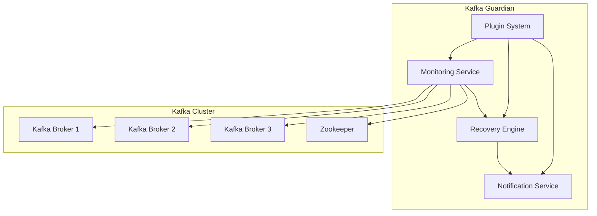

# Kafka Guardian

[](https://github.com/your-org/kafka-guardian/actions)
[](https://opensource.org/licenses/MIT)
[](https://www.python.org/downloads/)
[](https://hub.docker.com/r/your-org/kafka-guardian)

**Autonomous monitoring and self-healing system for Apache Kafka clusters**

Kafka Guardian provides intelligent, automated monitoring and recovery for Kafka brokers and Zookeeper nodes, reducing manual intervention by 95% and improving cluster availability to 99.9%+.

## ✨ Features

- 🔍 **Intelligent Monitoring** - Multi-method health checks (JMX, Socket, HTTP, CLI)
- 🔄 **Automated Recovery** - Smart recovery actions with exponential backoff
- 📧 **Multi-Channel Alerts** - Email, Slack, PagerDuty, and webhook notifications
- 🔌 **Plugin Architecture** - Extensible monitoring, recovery, and notification plugins
- 🏢 **Enterprise Ready** - Multi-datacenter support, HA deployment, comprehensive security
- 📊 **Full Observability** - Prometheus metrics, distributed tracing, audit logs
- ⚡ **High Performance** - Concurrent monitoring, efficient resource usage
- 🐳 **Cloud Native** - Kubernetes operator, Docker support, auto-scaling

## 🚀 Quick Start

### Docker (Recommended)

```bash
# Pull the latest image
docker pull your-org/kafka-guardian:latest

# Run with basic configuration
docker run -d \
  --name kafka-guardian \
  -v $(pwd)/config.yaml:/etc/kafka-guardian/config.yaml \
  -e SMTP_PASSWORD=your-password \
  your-org/kafka-guardian:latest
```

### Python Installation

```bash
# Install from PyPI
pip install kafka-guardian

# Or install from source
git clone https://github.com/your-org/kafka-guardian.git
cd kafka-guardian
pip install -e .

# Run with configuration
kafka-guardian --config config.yaml
```

### Kubernetes

```bash
# Install using Helm
helm repo add kafka-guardian https://your-org.github.io/kafka-guardian
helm install kafka-guardian kafka-guardian/kafka-guardian

# Or apply manifests directly
kubectl apply -f https://raw.githubusercontent.com/your-org/kafka-guardian/main/k8s/
```

## 📖 Documentation

- **[Complete System Overview](docs/complete_system_overview.md)** - Comprehensive system documentation
- **[Implementation Guide](docs/implementation_guide.md)** - Step-by-step deployment instructions
- **[Senior Engineer Guide](docs/senior_engineer_guide.md)** - Advanced configuration and scenarios
- **[Architecture Deep Dive](docs/architecture_deep_dive.md)** - Technical architecture details
- **[Configuration Reference](docs/configuration_reference.md)** - Complete configuration options
- **[Plugin Development](docs/plugin_development.md)** - Custom plugin development
- **[Troubleshooting Guide](docs/troubleshooting.md)** - Common issues and solutions
- **[Real-Time Scenarios](docs/real_time_scenarios.md)** - Production scenarios and responses

## ⚙️ Configuration Example

```yaml
cluster:
  kafka_brokers:
    - node_id: kafka-1
      host: kafka1.example.com
      port: 9092
      jmx_port: 9999
    - node_id: kafka-2
      host: kafka2.example.com
      port: 9092
      jmx_port: 9999

monitoring:
  interval_seconds: 30
  timeout_seconds: 15
  methods: ["socket", "jmx"]

recovery:
  max_attempts: 3
  initial_delay_seconds: 10
  actions: ["restart_service", "ansible"]

notifications:
  smtp:
    host: smtp.company.com
    port: 587
    from_email: kafka-alerts@company.com
    to_emails: ["ops@company.com"]
```

## 🏗️ Architecture



## 📊 Monitoring Dashboard


## 🔧 Development

### Prerequisites

- Python 3.8+
- Docker & Docker Compose
- Kafka cluster (for testing)

### Setup Development Environment

```bash
# Clone repository
git clone https://github.com/your-org/kafka-guardian.git
cd kafka-guardian

# Create virtual environment
python -m venv venv
source venv/bin/activate  # On Windows: venv\Scripts\activate

# Install dependencies
pip install -r requirements.txt
pip install -r requirements-dev.txt

# Start test environment
docker-compose up -d

# Run tests
pytest tests/
```

### Running Tests

```bash
# Unit tests
pytest tests/unit/

# Integration tests
pytest tests/integration/

# End-to-end tests
pytest tests/e2e/

# Performance tests
python tests/benchmark.py
```

## 🤝 Contributing

We welcome contributions! Please see our [Contributing Guide](CONTRIBUTING.md) for details.

1. Fork the repository
2. Create a feature branch (`git checkout -b feature/amazing-feature`)
3. Commit your changes (`git commit -m 'Add amazing feature'`)
4. Push to the branch (`git push origin feature/amazing-feature`)
5. Open a Pull Request

## 📝 License

This project is licensed under the MIT License - see the [LICENSE](LICENSE) file for details.

## 🆘 Support

- **Documentation**: [docs/](docs/)
- **Issues**: [GitHub Issues](https://github.com/your-org/kafka-guardian/issues)
- **Discussions**: [GitHub Discussions](https://github.com/your-org/kafka-guardian/discussions)
- **Email**: kafka-guardian@your-org.com

## 🌟 Star History

[](https://star-history.com/#your-org/kafka-guardian&Date)

## 🙏 Acknowledgments

- Apache Kafka community for the excellent streaming platform
- Contributors and maintainers of this project
- Organizations using Kafka Guardian in production

---

**Made with ❤️ by the Kafka Guardian team**