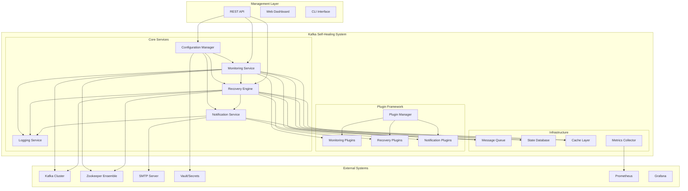
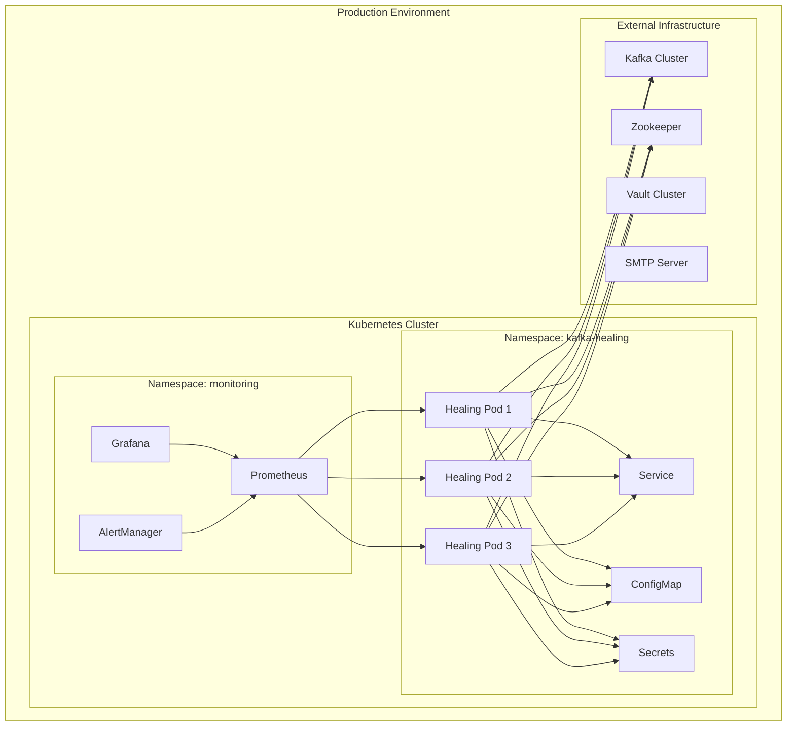
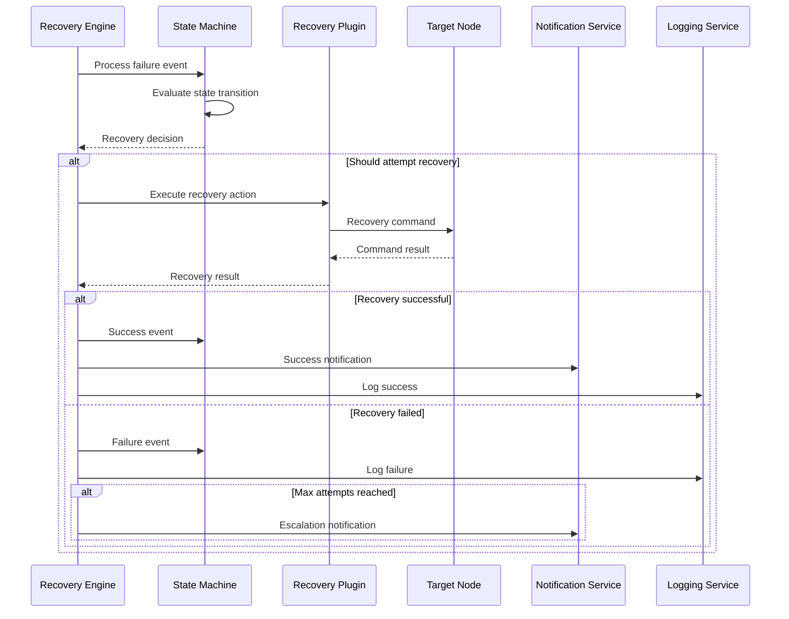

# Architecture Deep Dive - Kafka Self-Healing System

This document provides a comprehensive technical analysis of the Kafka Self-Healing system architecture, design patterns, and implementation details for architects and senior engineers.

## Table of Contents

1. [System Architecture Overview](#system-architecture-overview)
2. [Component Architecture](#component-architecture)
3. [Data Flow and Processing](#data-flow-and-processing)
4. [Design Patterns and Principles](#design-patterns-and-principles)
5. [Scalability Architecture](#scalability-architecture)
6. [Security Architecture](#security-architecture)
7. [Reliability and Resilience](#reliability-and-resilience)
8. [Performance Architecture](#performance-architecture)
9. [Integration Architecture](#integration-architecture)
10. [Future Architecture Considerations](#future-architecture-considerations)

## System Architecture Overview

### Architectural Principles

The Kafka Self-Healing system is built on the following architectural principles:

1. **Microservices Architecture**: Loosely coupled, independently deployable components
2. **Event-Driven Design**: Asynchronous communication through well-defined events
3. **Plugin-Based Extensibility**: Core functionality extended through plugins
4. **Fail-Safe Operations**: Graceful degradation when components fail
5. **Observable Systems**: Comprehensive logging, metrics, and tracing
6. **Configuration-Driven**: Behavior controlled through configuration, not code

### High-Level System Architecture



### Deployment Architecture



## Component Architecture

### Configuration Manager Architecture

```python
# Configuration Manager - Layered Architecture
class ConfigurationManager:
    """
    Layered configuration management with validation and hot-reloading
    """
    
    def __init__(self):
        self.layers = [
            DefaultConfigLayer(),      # Base defaults
            FileConfigLayer(),         # Configuration files
            EnvironmentConfigLayer(),  # Environment variables
            RuntimeConfigLayer()       # Runtime overrides
        ]
        self.validators = [
            SchemaValidator(),
            BusinessRuleValidator(),
            SecurityValidator()
        ]
        self.observers = []
        
    def load_configuration(self) -> Configuration:
        """Load configuration from all layers with validation"""
        config = Configuration()
        
        # Apply layers in order (later layers override earlier ones)
        for layer in self.layers:
            layer_config = layer.load()
            config = config.merge(layer_config)
            
        # Validate final configuration
        for validator in self.validators:
            validator.validate(config)
            
        return config
        
    def watch_for_changes(self):
        """Watch for configuration changes and notify observers"""
        for layer in self.layers:
            if hasattr(layer, 'watch'):
                layer.watch(self._on_config_change)
                
    def _on_config_change(self, change_event):
        """Handle configuration changes"""
        try:
            new_config = self.load_configuration()
            for observer in self.observers:
                observer.on_config_change(new_config, change_event)
        except ValidationError as e:
            logger.error(f"Configuration change rejected: {e}")
```

### Monitoring Service Architecture

```python
# Monitoring Service - Actor Model Implementation
class MonitoringService:
    """
    Actor-based monitoring service with concurrent health checking
    """
    
    def __init__(self, config):
        self.config = config
        self.actor_system = ActorSystem()
        self.node_actors = {}
        self.coordinator_actor = None
        self.plugin_manager = PluginManager()
        
    async def start(self):
        """Start the monitoring service"""
        # Start coordinator actor
        self.coordinator_actor = await self.actor_system.spawn(
            MonitoringCoordinator, 
            self.config
        )
        
        # Start node monitoring actors
        for node in self.config.nodes:
            actor = await self.actor_system.spawn(
                NodeMonitorActor,
                node,
                self.plugin_manager
            )
            self.node_actors[node.node_id] = actor
            
        # Start monitoring loop
        await self.coordinator_actor.send(StartMonitoring())
        
class NodeMonitorActor(Actor):
    """Individual node monitoring actor"""
    
    def __init__(self, node_config, plugin_manager):
        super().__init__()
        self.node_config = node_config
        self.plugin_manager = plugin_manager
        self.monitoring_plugins = plugin_manager.get_monitoring_plugins()
        self.health_history = CircularBuffer(size=100)
        
    async def handle_check_health(self, message):
        """Handle health check request"""
        results = []
        
        # Execute monitoring plugins in parallel
        tasks = []
        for plugin in self.monitoring_plugins:
            if plugin.supports_node_type(self.node_config.node_type):
                task = asyncio.create_task(
                    plugin.check_health(self.node_config)
                )
                tasks.append((plugin, task))
                
        # Collect results
        for plugin, task in tasks:
            try:
                result = await asyncio.wait_for(task, timeout=30)
                results.append(result)
            except asyncio.TimeoutError:
                logger.warning(f"Plugin {plugin.name} timed out for {self.node_config.node_id}")
            except Exception as e:
                logger.error(f"Plugin {plugin.name} failed: {e}")
                
        # Aggregate results
        final_status = self._aggregate_health_results(results)
        self.health_history.append(final_status)
        
        # Send result to coordinator
        await self.send_to_coordinator(HealthCheckResult(
            node_id=self.node_config.node_id,
            status=final_status,
            timestamp=datetime.utcnow()
        ))
```

### Recovery Engine Architecture

```python
# Recovery Engine - State Machine Implementation
class RecoveryEngine:
    """
    State machine-based recovery engine with pluggable actions
    """
    
    def __init__(self, config):
        self.config = config
        self.state_machines = {}
        self.recovery_plugins = PluginManager().get_recovery_plugins()
        self.action_queue = PriorityQueue()
        self.executor_pool = ThreadPoolExecutor(max_workers=5)
        
    async def handle_node_failure(self, failure_event):
        """Handle node failure event"""
        node_id = failure_event.node_id
        
        # Get or create state machine for node
        if node_id not in self.state_machines:
            self.state_machines[node_id] = NodeRecoveryStateMachine(
                node_id, 
                self.config.get_retry_policy(node_id)
            )
            
        state_machine = self.state_machines[node_id]
        
        # Process failure event
        await state_machine.process_event(failure_event)
        
        # Execute recovery actions if needed
        if state_machine.should_attempt_recovery():
            await self._schedule_recovery(node_id, failure_event)
            
class NodeRecoveryStateMachine:
    """State machine for individual node recovery"""
    
    def __init__(self, node_id, retry_policy):
        self.node_id = node_id
        self.retry_policy = retry_policy
        self.current_state = RecoveryState.HEALTHY
        self.attempt_count = 0
        self.last_failure_time = None
        self.recovery_history = []
        
    async def process_event(self, event):
        """Process recovery event and transition state"""
        if isinstance(event, NodeFailureEvent):
            await self._handle_failure_event(event)
        elif isinstance(event, RecoverySuccessEvent):
            await self._handle_success_event(event)
        elif isinstance(event, RecoveryFailureEvent):
            await self._handle_recovery_failure_event(event)
            
    async def _handle_failure_event(self, event):
        """Handle node failure event"""
        self.last_failure_time = event.timestamp
        
        if self.current_state == RecoveryState.HEALTHY:
            self.current_state = RecoveryState.FAILED
            self.attempt_count = 0
        elif self.current_state == RecoveryState.RECOVERING:
            # Recovery was in progress but node failed again
            self.current_state = RecoveryState.FAILED
            
    def should_attempt_recovery(self) -> bool:
        """Determine if recovery should be attempted"""
        if self.current_state != RecoveryState.FAILED:
            return False
            
        if self.attempt_count >= self.retry_policy.max_attempts:
            return False
            
        # Check if enough time has passed since last attempt
        if self.recovery_history:
            last_attempt = self.recovery_history[-1]
            min_delay = self._calculate_backoff_delay()
            if (datetime.utcnow() - last_attempt.timestamp).total_seconds() < min_delay:
                return False
                
        return True
```

### Notification Service Architecture

```python
# Notification Service - Publisher-Subscriber Pattern
class NotificationService:
    """
    Publisher-subscriber notification service with multiple channels
    """
    
    def __init__(self, config):
        self.config = config
        self.publishers = {}
        self.subscribers = {}
        self.notification_queue = asyncio.Queue()
        self.delivery_tracker = DeliveryTracker()
        
    async def start(self):
        """Start notification service"""
        # Initialize publishers
        for channel_config in self.config.notification_channels:
            publisher = self._create_publisher(channel_config)
            self.publishers[channel_config.name] = publisher
            
        # Start notification processor
        asyncio.create_task(self._process_notifications())
        
    async def publish_notification(self, notification):
        """Publish notification to appropriate channels"""
        # Determine target channels based on notification type and severity
        target_channels = self._determine_target_channels(notification)
        
        # Create delivery tasks
        delivery_tasks = []
        for channel in target_channels:
            if channel in self.publishers:
                task = DeliveryTask(
                    notification=notification,
                    channel=channel,
                    publisher=self.publishers[channel],
                    retry_policy=self.config.get_retry_policy(channel)
                )
                delivery_tasks.append(task)
                
        # Queue delivery tasks
        for task in delivery_tasks:
            await self.notification_queue.put(task)
            
    async def _process_notifications(self):
        """Process notification delivery queue"""
        while True:
            try:
                task = await self.notification_queue.get()
                await self._deliver_notification(task)
            except Exception as e:
                logger.error(f"Notification processing error: {e}")
                
    async def _deliver_notification(self, task):
        """Deliver individual notification with retry logic"""
        max_attempts = task.retry_policy.max_attempts
        
        for attempt in range(max_attempts):
            try:
                result = await task.publisher.send(task.notification)
                if result.success:
                    self.delivery_tracker.record_success(task)
                    return
                    
            except Exception as e:
                logger.warning(f"Notification delivery attempt {attempt + 1} failed: {e}")
                
            # Wait before retry
            if attempt < max_attempts - 1:
                delay = task.retry_policy.calculate_delay(attempt)
                await asyncio.sleep(delay)
                
        # All attempts failed
        self.delivery_tracker.record_failure(task)
        logger.error(f"Failed to deliver notification after {max_attempts} attempts")
```

## Data Flow and Processing

### Monitoring Data Flow

```mermaid
sequenceDiagram
    participant Timer as Monitoring Timer
    participant Coord as Monitoring Coordinator
    participant Actor as Node Monitor Actor
    participant Plugin as Monitoring Plugin
    participant Node as Kafka/ZK Node
    participant Engine as Recovery Engine
    participant Logger as Logging Service

    Timer->>Coord: Trigger monitoring cycle
    Coord->>Actor: Check node health
    Actor->>Plugin: Execute health check
    Plugin->>Node: Health check request
    Node-->>Plugin: Health response
    Plugin-->>Actor: Health result
    Actor->>Actor: Aggregate results
    Actor->>Coord: Health status
    
    alt Node is unhealthy
        Coord->>Engine: Node failure event
        Engine->>Engine: Evaluate recovery need
        Engine->>Logger: Log failure event
    else Node is healthy
        Coord->>Logger: Log health status
    end
```

### Recovery Data Flow



### Event Processing Architecture

```python
# Event-Driven Processing Pipeline
class EventProcessor:
    """
    Event processing pipeline with filtering, transformation, and routing
    """
    
    def __init__(self):
        self.pipeline_stages = [
            EventValidationStage(),
            EventEnrichmentStage(),
            EventFilteringStage(),
            EventTransformationStage(),
            EventRoutingStage()
        ]
        self.event_handlers = {}
        
    async def process_event(self, event):
        """Process event through pipeline stages"""
        current_event = event
        
        # Process through pipeline stages
        for stage in self.pipeline_stages:
            try:
                current_event = await stage.process(current_event)
                if current_event is None:
                    # Event was filtered out
                    return
            except Exception as e:
                logger.error(f"Pipeline stage {stage.__class__.__name__} failed: {e}")
                # Continue with original event
                current_event = event
                
        # Route to appropriate handlers
        await self._route_event(current_event)
        
    async def _route_event(self, event):
        """Route event to registered handlers"""
        event_type = type(event).__name__
        
        if event_type in self.event_handlers:
            handlers = self.event_handlers[event_type]
            
            # Execute handlers concurrently
            tasks = [handler.handle(event) for handler in handlers]
            results = await asyncio.gather(*tasks, return_exceptions=True)
            
            # Log any handler failures
            for i, result in enumerate(results):
                if isinstance(result, Exception):
                    logger.error(f"Event handler {handlers[i].__class__.__name__} failed: {result}")

class EventEnrichmentStage:
    """Enrich events with additional context"""
    
    async def process(self, event):
        """Add contextual information to event"""
        if hasattr(event, 'node_id'):
            # Add node metadata
            node_metadata = await self._get_node_metadata(event.node_id)
            event.metadata = node_metadata
            
        if hasattr(event, 'timestamp'):
            # Add time-based context
            event.time_context = {
                'hour_of_day': event.timestamp.hour,
                'day_of_week': event.timestamp.weekday(),
                'is_business_hours': self._is_business_hours(event.timestamp)
            }
            
        return event
```

## Design Patterns and Principles

### Plugin Architecture Pattern

```python
# Plugin Architecture with Dependency Injection
class PluginManager:
    """
    Plugin manager implementing dependency injection and lifecycle management
    """
    
    def __init__(self, config):
        self.config = config
        self.plugins = {}
        self.plugin_dependencies = {}
        self.lifecycle_manager = PluginLifecycleManager()
        
    def load_plugins(self, plugin_directories):
        """Load plugins with dependency resolution"""
        # Discover plugins
        discovered_plugins = self._discover_plugins(plugin_directories)
        
        # Resolve dependencies
        load_order = self._resolve_dependencies(discovered_plugins)
        
        # Load plugins in dependency order
        for plugin_info in load_order:
            try:
                plugin = self._instantiate_plugin(plugin_info)
                self.plugins[plugin_info.name] = plugin
                self.lifecycle_manager.register_plugin(plugin)
            except Exception as e:
                logger.error(f"Failed to load plugin {plugin_info.name}: {e}")
                
    def _resolve_dependencies(self, plugins):
        """Resolve plugin dependencies using topological sort"""
        dependency_graph = {}
        
        for plugin_info in plugins:
            dependencies = plugin_info.get_dependencies()
            dependency_graph[plugin_info.name] = dependencies
            
        # Topological sort
        return self._topological_sort(dependency_graph, plugins)
        
    def _instantiate_plugin(self, plugin_info):
        """Instantiate plugin with dependency injection"""
        # Get plugin class
        plugin_class = plugin_info.get_plugin_class()
        
        # Resolve dependencies
        dependencies = {}
        for dep_name in plugin_info.get_dependencies():
            if dep_name in self.plugins:
                dependencies[dep_name] = self.plugins[dep_name]
            else:
                raise PluginDependencyError(f"Dependency {dep_name} not available")
                
        # Create plugin instance
        plugin_config = self.config.get_plugin_config(plugin_info.name)
        return plugin_class(config=plugin_config, dependencies=dependencies)

# Plugin Base Classes with Contract Definition
class MonitoringPlugin(ABC):
    """Base class for monitoring plugins with well-defined contract"""
    
    def __init__(self, config=None, dependencies=None):
        self.config = config or {}
        self.dependencies = dependencies or {}
        self.metrics_collector = dependencies.get('metrics_collector')
        self.logger = dependencies.get('logger')
        
    @abstractmethod
    async def check_health(self, node_config) -> NodeStatus:
        """Check health of a node - must be implemented by subclasses"""
        pass
        
    @abstractmethod
    def get_supported_node_types(self) -> List[str]:
        """Return list of supported node types"""
        pass
        
    def validate_config(self) -> ValidationResult:
        """Validate plugin configuration"""
        return ValidationResult(valid=True)
        
    async def initialize(self):
        """Initialize plugin resources"""
        pass
        
    async def cleanup(self):
        """Cleanup plugin resources"""
        pass
        
    def get_health_score(self, metrics) -> float:
        """Calculate health score from metrics (0.0 to 1.0)"""
        return 1.0 if metrics.get('responsive', False) else 0.0
```

### Observer Pattern for Event Handling

```python
# Observer Pattern Implementation
class EventObserver(ABC):
    """Base class for event observers"""
    
    @abstractmethod
    async def on_event(self, event):
        """Handle event notification"""
        pass

class EventSubject:
    """Subject that notifies observers of events"""
    
    def __init__(self):
        self._observers = []
        
    def attach(self, observer: EventObserver):
        """Attach an observer"""
        self._observers.append(observer)
        
    def detach(self, observer: EventObserver):
        """Detach an observer"""
        self._observers.remove(observer)
        
    async def notify(self, event):
        """Notify all observers of an event"""
        tasks = [observer.on_event(event) for observer in self._observers]
        await asyncio.gather(*tasks, return_exceptions=True)

# Concrete Observer Implementations
class MetricsCollectorObserver(EventObserver):
    """Observer that collects metrics from events"""
    
    async def on_event(self, event):
        if isinstance(event, HealthCheckEvent):
            self._record_health_check_metrics(event)
        elif isinstance(event, RecoveryEvent):
            self._record_recovery_metrics(event)
            
class AuditLogObserver(EventObserver):
    """Observer that logs events for audit purposes"""
    
    async def on_event(self, event):
        audit_entry = {
            'timestamp': event.timestamp.isoformat(),
            'event_type': type(event).__name__,
            'event_data': event.to_dict(),
            'correlation_id': event.correlation_id
        }
        await self.audit_logger.log(audit_entry)
```

### Circuit Breaker Pattern

```python
# Circuit Breaker for External Service Calls
class CircuitBreaker:
    """Circuit breaker implementation for fault tolerance"""
    
    def __init__(self, failure_threshold=5, recovery_timeout=60, expected_exception=Exception):
        self.failure_threshold = failure_threshold
        self.recovery_timeout = recovery_timeout
        self.expected_exception = expected_exception
        
        self.failure_count = 0
        self.last_failure_time = None
        self.state = CircuitBreakerState.CLOSED
        
    async def call(self, func, *args, **kwargs):
        """Execute function with circuit breaker protection"""
        if self.state == CircuitBreakerState.OPEN:
            if self._should_attempt_reset():
                self.state = CircuitBreakerState.HALF_OPEN
            else:
                raise CircuitBreakerOpenException("Circuit breaker is open")
                
        try:
            result = await func(*args, **kwargs)
            self._on_success()
            return result
            
        except self.expected_exception as e:
            self._on_failure()
            raise e
            
    def _on_success(self):
        """Handle successful call"""
        self.failure_count = 0
        self.state = CircuitBreakerState.CLOSED
        
    def _on_failure(self):
        """Handle failed call"""
        self.failure_count += 1
        self.last_failure_time = time.time()
        
        if self.failure_count >= self.failure_threshold:
            self.state = CircuitBreakerState.OPEN
            
    def _should_attempt_reset(self):
        """Check if circuit breaker should attempt reset"""
        return (time.time() - self.last_failure_time) >= self.recovery_timeout

# Usage in monitoring plugins
class ResilientJMXMonitoringPlugin(MonitoringPlugin):
    """JMX monitoring plugin with circuit breaker"""
    
    def __init__(self, config, dependencies):
        super().__init__(config, dependencies)
        self.circuit_breaker = CircuitBreaker(
            failure_threshold=3,
            recovery_timeout=30,
            expected_exception=JMXConnectionException
        )
        
    async def check_health(self, node_config):
        """Check health with circuit breaker protection"""
        try:
            return await self.circuit_breaker.call(
                self._perform_jmx_check, 
                node_config
            )
        except CircuitBreakerOpenException:
            # Circuit breaker is open, return cached status or default
            return self._get_fallback_status(node_config)
```

## Scalability Architecture

### Horizontal Scaling Design

```python
# Distributed Coordination for Horizontal Scaling
class DistributedCoordinator:
    """Coordinate work across multiple instances"""
    
    def __init__(self, config):
        self.node_id = config.get('node_id', socket.gethostname())
        self.coordination_backend = self._create_backend(config)
        self.work_distributor = ConsistentHashRing()
        self.leader_election = LeaderElection(self.coordination_backend)
        
    async def start(self):
        """Start distributed coordination"""
        # Join cluster
        await self.coordination_backend.join_cluster(self.node_id)
        
        # Participate in leader election
        asyncio.create_task(self.leader_election.participate())
        
        # Start work distribution
        asyncio.create_task(self._distribute_work())
        
    async def _distribute_work(self):
        """Distribute monitoring work across cluster nodes"""
        while True:
            try:
                # Get current cluster members
                cluster_members = await self.coordination_backend.get_cluster_members()
                
                # Update work distribution
                self.work_distributor.update_nodes(cluster_members)
                
                # Get work assignments for this node
                my_assignments = self.work_distributor.get_assignments(self.node_id)
                
                # Update local monitoring configuration
                await self._update_monitoring_assignments(my_assignments)
                
                await asyncio.sleep(30)  # Rebalance every 30 seconds
                
            except Exception as e:
                logger.error(f"Work distribution error: {e}")
                await asyncio.sleep(5)

class ConsistentHashRing:
    """Consistent hashing for work distribution"""
    
    def __init__(self, virtual_nodes=150):
        self.virtual_nodes = virtual_nodes
        self.ring = {}
        self.sorted_keys = []
        
    def add_node(self, node_id):
        """Add node to hash ring"""
        for i in range(self.virtual_nodes):
            key = self._hash(f"{node_id}:{i}")
            self.ring[key] = node_id
            
        self._update_sorted_keys()
        
    def remove_node(self, node_id):
        """Remove node from hash ring"""
        keys_to_remove = [k for k, v in self.ring.items() if v == node_id]
        for key in keys_to_remove:
            del self.ring[key]
            
        self._update_sorted_keys()
        
    def get_node(self, key):
        """Get responsible node for key"""
        if not self.ring:
            return None
            
        hash_key = self._hash(key)
        
        # Find first node clockwise from hash
        for ring_key in self.sorted_keys:
            if hash_key <= ring_key:
                return self.ring[ring_key]
                
        # Wrap around to first node
        return self.ring[self.sorted_keys[0]]
```

### Auto-Scaling Configuration

```yaml
# Kubernetes HPA configuration
apiVersion: autoscaling/v2
kind: HorizontalPodAutoscaler
metadata:
  name: kafka-healing-hpa
spec:
  scaleTargetRef:
    apiVersion: apps/v1
    kind: Deployment
    name: kafka-healing
  minReplicas: 2
  maxReplicas: 10
  metrics:
  - type: Resource
    resource:
      name: cpu
      target:
        type: Utilization
        averageUtilization: 70
  - type: Resource
    resource:
      name: memory
      target:
        type: Utilization
        averageUtilization: 80
  - type: Pods
    pods:
      metric:
        name: monitoring_queue_length
      target:
        type: AverageValue
        averageValue: "100"
  behavior:
    scaleUp:
      stabilizationWindowSeconds: 60
      policies:
      - type: Percent
        value: 100
        periodSeconds: 15
    scaleDown:
      stabilizationWindowSeconds: 300
      policies:
      - type: Percent
        value: 10
        periodSeconds: 60
```

## Security Architecture

### Zero-Trust Security Model

```python
# Zero-Trust Security Implementation
class ZeroTrustSecurityManager:
    """Implement zero-trust security principles"""
    
    def __init__(self, config):
        self.config = config
        self.identity_provider = IdentityProvider(config)
        self.policy_engine = PolicyEngine(config)
        self.audit_logger = AuditLogger(config)
        
    async def authenticate_request(self, request):
        """Authenticate and authorize request"""
        # Extract identity from request
        identity = await self.identity_provider.extract_identity(request)
        
        if not identity:
            raise AuthenticationError("No valid identity found")
            
        # Verify identity
        verified_identity = await self.identity_provider.verify_identity(identity)
        
        if not verified_identity:
            raise AuthenticationError("Identity verification failed")
            
        # Check authorization
        authorized = await self.policy_engine.check_authorization(
            verified_identity, 
            request.resource, 
            request.action
        )
        
        if not authorized:
            await self.audit_logger.log_unauthorized_access(
                verified_identity, 
                request
            )
            raise AuthorizationError("Access denied")
            
        # Log successful access
        await self.audit_logger.log_authorized_access(
            verified_identity, 
            request
        )
        
        return verified_identity

class PolicyEngine:
    """Policy-based authorization engine"""
    
    def __init__(self, config):
        self.policies = self._load_policies(config)
        
    async def check_authorization(self, identity, resource, action):
        """Check if identity is authorized for action on resource"""
        for policy in self.policies:
            if await policy.matches(identity, resource, action):
                return await policy.evaluate(identity, resource, action)
                
        # Default deny
        return False
        
    def _load_policies(self, config):
        """Load authorization policies"""
        policies = []
        
        for policy_config in config.get('authorization_policies', []):
            policy = self._create_policy(policy_config)
            policies.append(policy)
            
        return policies

# Example Policy Implementation
class RBACPolicy:
    """Role-based access control policy"""
    
    def __init__(self, config):
        self.role_mappings = config.get('role_mappings', {})
        self.permissions = config.get('permissions', {})
        
    async def matches(self, identity, resource, action):
        """Check if this policy applies"""
        return 'roles' in identity.attributes
        
    async def evaluate(self, identity, resource, action):
        """Evaluate policy for identity"""
        user_roles = identity.attributes.get('roles', [])
        required_permission = f"{action}:{resource}"
        
        for role in user_roles:
            role_permissions = self.permissions.get(role, [])
            if required_permission in role_permissions or "*:*" in role_permissions:
                return True
                
        return False
```

### Encryption and Key Management

```python
# Encryption and Key Management
class EncryptionManager:
    """Manage encryption keys and operations"""
    
    def __init__(self, config):
        self.config = config
        self.key_provider = self._create_key_provider(config)
        self.cipher_suite = self._create_cipher_suite(config)
        
    async def encrypt_sensitive_data(self, data, context=None):
        """Encrypt sensitive data with context"""
        # Get encryption key
        key = await self.key_provider.get_encryption_key(context)
        
        # Generate nonce
        nonce = os.urandom(12)
        
        # Encrypt data
        encrypted_data = self.cipher_suite.encrypt(
            data.encode('utf-8'), 
            key, 
            nonce
        )
        
        return {
            'encrypted_data': base64.b64encode(encrypted_data).decode('utf-8'),
            'nonce': base64.b64encode(nonce).decode('utf-8'),
            'key_id': key.key_id,
            'algorithm': self.cipher_suite.algorithm
        }
        
    async def decrypt_sensitive_data(self, encrypted_package):
        """Decrypt sensitive data"""
        # Get decryption key
        key = await self.key_provider.get_decryption_key(
            encrypted_package['key_id']
        )
        
        # Decrypt data
        encrypted_data = base64.b64decode(encrypted_package['encrypted_data'])
        nonce = base64.b64decode(encrypted_package['nonce'])
        
        decrypted_data = self.cipher_suite.decrypt(
            encrypted_data, 
            key, 
            nonce
        )
        
        return decrypted_data.decode('utf-8')

class VaultKeyProvider:
    """HashiCorp Vault key provider"""
    
    def __init__(self, config):
        self.vault_client = hvac.Client(
            url=config.get('vault_url'),
            token=config.get('vault_token')
        )
        self.key_path = config.get('key_path', 'secret/kafka-healing/keys')
        
    async def get_encryption_key(self, context=None):
        """Get encryption key from Vault"""
        key_name = self._determine_key_name(context)
        
        try:
            response = self.vault_client.secrets.kv.v2.read_secret_version(
                path=f"{self.key_path}/{key_name}"
            )
            
            key_data = response['data']['data']
            return EncryptionKey(
                key_id=key_data['key_id'],
                key_material=base64.b64decode(key_data['key_material']),
                algorithm=key_data.get('algorithm', 'AES-256-GCM')
            )
            
        except Exception as e:
            logger.error(f"Failed to retrieve encryption key: {e}")
            raise KeyRetrievalError(f"Cannot retrieve key {key_name}")
```

This architecture deep dive provides comprehensive technical details for understanding and implementing the Kafka Self-Healing system. Each section includes practical code examples and architectural patterns that can be directly applied in production environments.