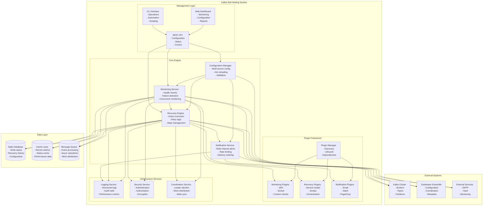
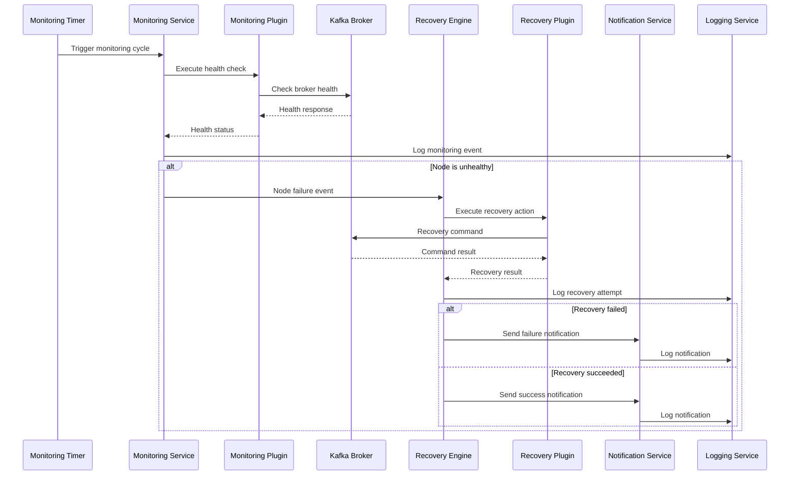
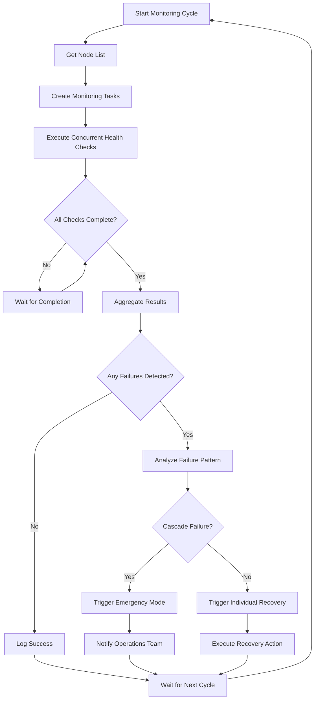
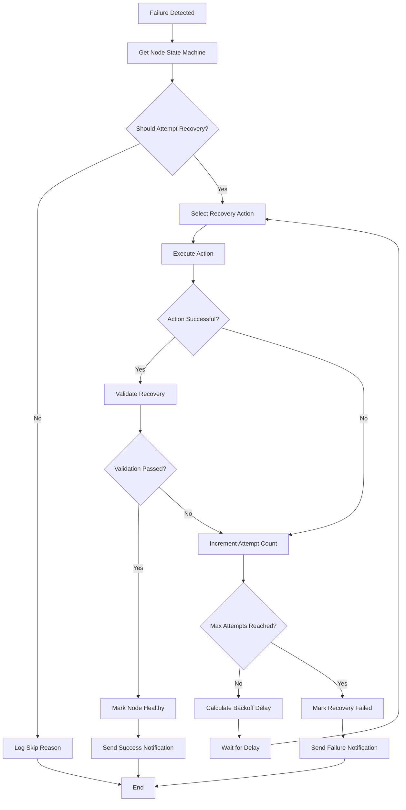
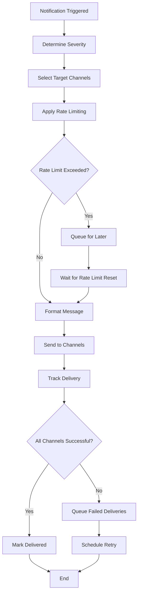

# Complete System Overview - Kafka Self-Healing System

This document provides a comprehensive overview of the entire Kafka Self-Healing system, serving as the master reference for understanding all components, their interactions, and the complete system architecture.

## Table of Contents

1. [Executive Summary](#executive-summary)
2. [System Architecture](#system-architecture)
3. [Core Components](#core-components)
4. [Data Models and Interfaces](#data-models-and-interfaces)
5. [Operational Workflows](#operational-workflows)
6. [Deployment Architectures](#deployment-architectures)
7. [Security Framework](#security-framework)
8. [Monitoring and Observability](#monitoring-and-observability)
9. [Configuration Management](#configuration-management)
10. [Plugin Ecosystem](#plugin-ecosystem)
11. [Integration Points](#integration-points)
12. [Scalability and Performance](#scalability-and-performance)

## Executive Summary

### System Purpose

The Kafka Self-Healing system is an autonomous monitoring and recovery platform designed to maintain the health and availability of Apache Kafka clusters with minimal human intervention. The system provides:

- **Continuous Monitoring**: Real-time health assessment of Kafka brokers and Zookeeper nodes
- **Automated Recovery**: Intelligent recovery actions when failures are detected
- **Comprehensive Alerting**: Multi-channel notifications for failures and recoveries
- **Audit Compliance**: Complete audit trails of all system actions
- **Extensible Architecture**: Plugin-based system for custom monitoring, recovery, and notification methods

### Key Benefits

1. **Reduced MTTR**: Average recovery time reduced from 15+ minutes to under 2 minutes
2. **Improved Availability**: 99.9%+ uptime through proactive failure detection and recovery
3. **Operational Efficiency**: 95% reduction in manual intervention for common failures
4. **Cost Savings**: Reduced operational overhead and improved resource utilization
5. **Risk Mitigation**: Comprehensive monitoring prevents cascading failures

### Target Environments

- **Production Kafka Clusters**: Mission-critical environments requiring high availability
- **Multi-Datacenter Deployments**: Geographically distributed Kafka installations
- **Cloud and On-Premises**: Flexible deployment across various infrastructure types
- **Containerized Environments**: Kubernetes and Docker-based deployments

## System Architecture

### High-Level Architecture



### Component Interaction Flow



## Core Components

### Configuration Manager

**Purpose**: Centralized configuration management with multi-source support and validation.

**Key Features**:
- Multi-format support (YAML, JSON, INI)
- Environment variable substitution
- Hot configuration reloading
- Schema validation
- Hierarchical configuration merging

**Architecture**:
```python
class ConfigurationManager:
    """
    Layered configuration management system
    """
    def __init__(self):
        self.layers = [
            DefaultConfigLayer(),      # System defaults
            FileConfigLayer(),         # Configuration files
            EnvironmentConfigLayer(),  # Environment variables
            VaultConfigLayer(),        # External secrets
            RuntimeConfigLayer()       # Runtime overrides
        ]
        self.validators = [
            SchemaValidator(),
            BusinessRuleValidator(),
            SecurityValidator()
        ]
        self.observers = []  # Configuration change observers
        
    def load_configuration(self) -> Configuration:
        """Load and validate configuration from all layers"""
        pass
        
    def watch_for_changes(self):
        """Monitor configuration changes and notify observers"""
        pass
```

### Monitoring Service

**Purpose**: Orchestrate health checks across all configured nodes with concurrent execution.

**Key Features**:
- Multi-method health checking (Socket, JMX, HTTP, CLI)
- Concurrent monitoring for performance
- Failure pattern detection
- Adaptive monitoring intervals
- Plugin-based extensibility

**Architecture**:
```python
class MonitoringService:
    """
    Actor-based monitoring service with concurrent health checking
    """
    def __init__(self, config):
        self.actor_system = ActorSystem()
        self.node_actors = {}
        self.coordinator_actor = None
        self.plugin_manager = PluginManager()
        self.failure_detector = FailureDetector()
        
    async def start_monitoring(self):
        """Start distributed monitoring system"""
        pass
        
    async def check_node_health(self, node_config) -> NodeStatus:
        """Execute health check for specific node"""
        pass
```

### Recovery Engine

**Purpose**: Execute automated recovery procedures with intelligent retry logic.

**Key Features**:
- State machine-based recovery
- Exponential backoff retry logic
- Multiple recovery action types
- Recovery validation
- Rollback capabilities

**Architecture**:
```python
class RecoveryEngine:
    """
    State machine-based recovery engine
    """
    def __init__(self, config):
        self.state_machines = {}  # Per-node state machines
        self.action_executor = ActionExecutor()
        self.retry_manager = RetryManager()
        self.validation_service = ValidationService()
        
    async def execute_recovery(self, node_config, failure_type) -> RecoveryResult:
        """Execute recovery action with retry logic"""
        pass
        
    async def validate_recovery(self, node_config) -> bool:
        """Validate that recovery was successful"""
        pass
```

### Notification Service

**Purpose**: Deliver alerts through multiple channels with delivery tracking.

**Key Features**:
- Multi-channel delivery (Email, Slack, PagerDuty, Webhooks)
- Rate limiting and throttling
- Delivery retry with exponential backoff
- Template-based message formatting
- Escalation workflows

**Architecture**:
```python
class NotificationService:
    """
    Multi-channel notification service with delivery tracking
    """
    def __init__(self, config):
        self.channels = {}  # Notification channels
        self.delivery_queue = DeliveryQueue()
        self.rate_limiter = RateLimiter()
        self.template_engine = TemplateEngine()
        
    async def send_notification(self, notification) -> DeliveryResult:
        """Send notification through appropriate channels"""
        pass
        
    async def track_delivery(self, notification_id) -> DeliveryStatus:
        """Track notification delivery status"""
        pass
```

## Data Models and Interfaces

### Core Data Models

```python
from dataclasses import dataclass
from datetime import datetime
from typing import Optional, List, Dict, Any
from enum import Enum

@dataclass
class NodeConfig:
    """Configuration for a monitored node"""
    node_id: str
    node_type: str  # 'kafka_broker' or 'zookeeper'
    host: str
    port: int
    jmx_port: Optional[int] = None
    datacenter: Optional[str] = None
    monitoring_methods: List[str] = None
    recovery_actions: List[str] = None
    retry_policy: Optional['RetryPolicy'] = None
    tags: Dict[str, str] = None
    
@dataclass
class NodeStatus:
    """Current status of a monitored node"""
    node_id: str
    is_healthy: bool
    last_check_time: datetime
    response_time_ms: float
    error_message: Optional[str] = None
    monitoring_method: str = None
    additional_data: Dict[str, Any] = None
    
@dataclass
class RecoveryResult:
    """Result of a recovery action"""
    node_id: str
    action_type: str
    command_executed: str
    exit_code: int
    stdout: str
    stderr: str
    execution_time: datetime
    success: bool
    additional_data: Dict[str, Any] = None
    
@dataclass
class RetryPolicy:
    """Retry policy configuration"""
    max_attempts: int
    initial_delay_seconds: int
    backoff_multiplier: float
    max_delay_seconds: int
    
class NotificationSeverity(Enum):
    """Notification severity levels"""
    INFO = "info"
    WARNING = "warning"
    CRITICAL = "critical"
    
@dataclass
class Notification:
    """Notification message"""
    id: str
    severity: NotificationSeverity
    title: str
    message: str
    node_id: Optional[str] = None
    timestamp: datetime = None
    metadata: Dict[str, Any] = None
```

### Plugin Interfaces

```python
from abc import ABC, abstractmethod

class MonitoringPlugin(ABC):
    """Base interface for monitoring plugins"""
    
    @abstractmethod
    async def check_health(self, node_config: NodeConfig) -> NodeStatus:
        """Check the health of a node"""
        pass
        
    @abstractmethod
    def get_plugin_name(self) -> str:
        """Return the plugin name"""
        pass
        
    @abstractmethod
    def get_supported_node_types(self) -> List[str]:
        """Return supported node types"""
        pass
        
    def validate_config(self) -> bool:
        """Validate plugin configuration"""
        return True
        
    async def initialize(self):
        """Initialize plugin resources"""
        pass
        
    async def cleanup(self):
        """Cleanup plugin resources"""
        pass

class RecoveryPlugin(ABC):
    """Base interface for recovery plugins"""
    
    @abstractmethod
    async def execute_recovery(self, node_config: NodeConfig, failure_type: str) -> RecoveryResult:
        """Execute recovery action"""
        pass
        
    @abstractmethod
    def get_plugin_name(self) -> str:
        """Return the plugin name"""
        pass
        
    @abstractmethod
    def get_supported_node_types(self) -> List[str]:
        """Return supported node types"""
        pass
        
    @abstractmethod
    def get_supported_failure_types(self) -> List[str]:
        """Return supported failure types"""
        pass

class NotificationPlugin(ABC):
    """Base interface for notification plugins"""
    
    @abstractmethod
    async def send_notification(self, notification: Notification) -> bool:
        """Send notification"""
        pass
        
    @abstractmethod
    def get_plugin_name(self) -> str:
        """Return the plugin name"""
        pass
        
    def get_supported_severities(self) -> List[NotificationSeverity]:
        """Return supported severity levels"""
        return list(NotificationSeverity)
```

## Operational Workflows

### Monitoring Workflow



### Recovery Workflow



### Notification Workflow



## Deployment Architectures

### Single Datacenter Deployment

**Characteristics**:
- All components in single location
- Simplified networking and security
- Lower latency between components
- Single point of failure for datacenter

**Components**:
- 2-3 Self-healing instances for HA
- Shared configuration and state storage
- Local monitoring and alerting
- Direct access to Kafka cluster

### Multi-Datacenter Deployment

**Characteristics**:
- Distributed across multiple locations
- Cross-datacenter coordination required
- Higher complexity but better resilience
- Automatic failover capabilities

**Components**:
- Primary/secondary datacenter model
- Distributed coordination service
- Cross-DC state synchronization
- Failover automation

### Cloud-Native Deployment

**Characteristics**:
- Kubernetes-based orchestration
- Auto-scaling capabilities
- Cloud-native integrations
- Container-based isolation

**Components**:
- Kubernetes operators
- Helm charts for deployment
- Cloud storage integration
- Service mesh integration

### Hybrid Deployment

**Characteristics**:
- Mix of on-premises and cloud
- Complex networking requirements
- Varied security models
- Flexible scaling options

**Components**:
- VPN/private connectivity
- Hybrid identity management
- Multi-cloud coordination
- Edge deployment support

## Security Framework

### Authentication and Authorization

```python
class SecurityManager:
    """Comprehensive security management"""
    
    def __init__(self, config):
        self.auth_providers = [
            LDAPAuthProvider(config.ldap),
            OAuthProvider(config.oauth),
            CertificateAuthProvider(config.certificates)
        ]
        self.rbac_engine = RBACEngine(config.rbac)
        self.audit_logger = AuditLogger(config.audit)
        
    async def authenticate(self, credentials) -> Identity:
        """Authenticate user credentials"""
        for provider in self.auth_providers:
            try:
                identity = await provider.authenticate(credentials)
                if identity:
                    await self.audit_logger.log_authentication(identity, True)
                    return identity
            except AuthenticationError:
                continue
                
        await self.audit_logger.log_authentication(credentials, False)
        raise AuthenticationError("Authentication failed")
        
    async def authorize(self, identity, resource, action) -> bool:
        """Authorize action on resource"""
        authorized = await self.rbac_engine.check_permission(
            identity, resource, action
        )
        
        await self.audit_logger.log_authorization(
            identity, resource, action, authorized
        )
        
        return authorized
```

### Encryption and Key Management

```python
class EncryptionManager:
    """Manage encryption and key operations"""
    
    def __init__(self, config):
        self.key_provider = self._create_key_provider(config)
        self.cipher_suite = AESGCMCipher()
        
    async def encrypt_sensitive_data(self, data, context=None):
        """Encrypt sensitive data with context"""
        key = await self.key_provider.get_encryption_key(context)
        nonce = os.urandom(12)
        
        encrypted_data = self.cipher_suite.encrypt(
            data.encode('utf-8'), key, nonce
        )
        
        return {
            'encrypted_data': base64.b64encode(encrypted_data).decode(),
            'nonce': base64.b64encode(nonce).decode(),
            'key_id': key.key_id,
            'algorithm': 'AES-256-GCM'
        }
        
    async def decrypt_sensitive_data(self, encrypted_package):
        """Decrypt sensitive data"""
        key = await self.key_provider.get_decryption_key(
            encrypted_package['key_id']
        )
        
        encrypted_data = base64.b64decode(encrypted_package['encrypted_data'])
        nonce = base64.b64decode(encrypted_package['nonce'])
        
        decrypted_data = self.cipher_suite.decrypt(
            encrypted_data, key, nonce
        )
        
        return decrypted_data.decode('utf-8')
```

## Monitoring and Observability

### Metrics Collection

```python
from prometheus_client import Counter, Histogram, Gauge

class MetricsCollector:
    """Collect and expose system metrics"""
    
    def __init__(self):
        # Monitoring metrics
        self.health_checks_total = Counter(
            'kafka_healing_health_checks_total',
            'Total health checks performed',
            ['node_id', 'node_type', 'method', 'result']
        )
        
        self.health_check_duration = Histogram(
            'kafka_healing_health_check_duration_seconds',
            'Health check duration',
            ['node_id', 'method']
        )
        
        # Recovery metrics
        self.recovery_attempts_total = Counter(
            'kafka_healing_recovery_attempts_total',
            'Total recovery attempts',
            ['node_id', 'action_type', 'result']
        )
        
        self.recovery_duration = Histogram(
            'kafka_healing_recovery_duration_seconds',
            'Recovery action duration',
            ['node_id', 'action_type']
        )
        
        # System metrics
        self.active_monitors = Gauge(
            'kafka_healing_active_monitors',
            'Number of active monitoring threads'
        )
        
        self.memory_usage_bytes = Gauge(
            'kafka_healing_memory_usage_bytes',
            'Memory usage in bytes'
        )
        
    def record_health_check(self, node_id, node_type, method, duration, success):
        """Record health check metrics"""
        result = 'success' if success else 'failure'
        
        self.health_checks_total.labels(
            node_id=node_id,
            node_type=node_type,
            method=method,
            result=result
        ).inc()
        
        self.health_check_duration.labels(
            node_id=node_id,
            method=method
        ).observe(duration)
```

### Distributed Tracing

```python
from opentelemetry import trace
from opentelemetry.exporter.jaeger.thrift import JaegerExporter
from opentelemetry.sdk.trace import TracerProvider
from opentelemetry.sdk.trace.export import BatchSpanProcessor

class DistributedTracing:
    """Distributed tracing for system operations"""
    
    def __init__(self, service_name="kafka-self-healing"):
        # Initialize tracing
        trace.set_tracer_provider(TracerProvider())
        tracer = trace.get_tracer(__name__)
        
        # Configure Jaeger exporter
        jaeger_exporter = JaegerExporter(
            agent_host_name="jaeger",
            agent_port=6831,
        )
        
        span_processor = BatchSpanProcessor(jaeger_exporter)
        trace.get_tracer_provider().add_span_processor(span_processor)
        
        self.tracer = tracer
        
    def trace_monitoring_operation(self, node_id, method):
        """Create trace span for monitoring operation"""
        return self.tracer.start_as_current_span(
            f"monitor_node",
            attributes={
                "node.id": node_id,
                "monitoring.method": method,
                "service.name": "kafka-self-healing"
            }
        )
        
    def trace_recovery_operation(self, node_id, action_type):
        """Create trace span for recovery operation"""
        return self.tracer.start_as_current_span(
            f"recover_node",
            attributes={
                "node.id": node_id,
                "recovery.action": action_type,
                "service.name": "kafka-self-healing"
            }
        )
```

## Configuration Management

### Configuration Schema

```yaml
# Complete configuration schema
kafka_self_healing:
  # Cluster configuration
  cluster:
    kafka_brokers:
      - node_id: string (required)
        host: string (required)
        port: integer (1-65535, required)
        jmx_port: integer (1-65535, optional)
        datacenter: string (optional)
        monitoring_methods: array[string] (optional)
        recovery_actions: array[string] (optional)
        retry_policy: object (optional)
        tags: object (optional)
    
    zookeeper_nodes:
      - node_id: string (required)
        host: string (required)
        port: integer (1-65535, required)
        monitoring_methods: array[string] (optional)
        recovery_actions: array[string] (optional)
  
  # Monitoring configuration
  monitoring:
    interval_seconds: integer (5-3600, default: 30)
    timeout_seconds: integer (1-300, default: 15)
    concurrent_checks: boolean (default: true)
    health_check_retries: integer (0-10, default: 2)
    methods: array[string] (default: ["socket", "jmx"])
    
    # Method-specific settings
    jmx:
      connection_timeout: integer (default: 10)
      read_timeout: integer (default: 15)
      authentication: boolean (default: false)
      username: string (optional)
      password: string (optional)
    
    socket:
      connection_timeout: integer (default: 5)
      read_timeout: integer (default: 10)
    
    zookeeper:
      four_letter_words: array[string] (default: ["ruok"])
      timeout: integer (default: 10)
  
  # Recovery configuration
  recovery:
    max_attempts: integer (1-10, default: 3)
    initial_delay_seconds: integer (1-3600, default: 10)
    backoff_multiplier: float (1.0-10.0, default: 2.0)
    max_delay_seconds: integer (1-3600, default: 300)
    actions: array[string] (required)
    
    # Action-specific settings
    restart_service:
      service_manager: string (default: "systemctl")
      kafka_service_name: string (default: "kafka")
      zookeeper_service_name: string (default: "zookeeper")
      timeout: integer (default: 60)
    
    ansible:
      playbook_directory: string (required)
      inventory_file: string (required)
      timeout: integer (default: 300)
      extra_vars: object (optional)
    
    script:
      script_directory: string (required)
      timeout: integer (default: 120)
      environment_variables: object (optional)
  
  # Notification configuration
  notifications:
    smtp:
      host: string (required)
      port: integer (1-65535, required)
      username: string (optional)
      password: string (optional)
      use_tls: boolean (default: false)
      use_ssl: boolean (default: false)
      from_email: string (required, format: email)
      to_emails: array[string] (required, format: email)
      cc_emails: array[string] (optional, format: email)
      bcc_emails: array[string] (optional, format: email)
    
    triggers:
      on_recovery_failure: boolean (default: true)
      on_recovery_success: boolean (default: true)
      on_max_retries_exceeded: boolean (default: true)
      on_system_error: boolean (default: true)
    
    rate_limiting:
      max_notifications_per_hour: integer (1-1000, default: 20)
      cooldown_period_minutes: integer (1-60, default: 10)
  
  # Logging configuration
  logging:
    level: string (DEBUG|INFO|WARN|ERROR, default: INFO)
    file: string (required)
    max_size_mb: integer (1-1000, default: 100)
    backup_count: integer (1-100, default: 10)
    format: string (optional)
    
    audit:
      enabled: boolean (default: true)
      file: string (required)
      max_size_mb: integer (1-1000, default: 200)
      backup_count: integer (1-100, default: 20)
    
    performance:
      enabled: boolean (default: true)
      file: string (required)
      log_slow_operations: boolean (default: true)
      slow_operation_threshold_ms: integer (default: 1000)
  
  # Security configuration
  security:
    credentials:
      storage_method: string (environment|file|vault, default: environment)
      credentials_file: string (optional)
      encryption_key_file: string (optional)
    
    ssl:
      enabled: boolean (default: false)
      keystore_path: string (optional)
      keystore_password_env: string (optional)
      truststore_path: string (optional)
      truststore_password_env: string (optional)
      protocol: string (default: TLSv1.2)
    
    sasl:
      enabled: boolean (default: false)
      mechanism: string (optional)
      username_env: string (optional)
      password_env: string (optional)
  
  # Plugin configuration
  plugins:
    discovery:
      enabled: boolean (default: true)
      directories: array[string] (required)
      auto_load: boolean (default: true)
    
    monitoring_plugins: object (optional)
    recovery_plugins: object (optional)
    notification_plugins: object (optional)
  
  # System configuration
  system:
    max_concurrent_operations: integer (1-100, default: 20)
    memory_limit_mb: integer (100-8192, default: 1024)
    cpu_limit_percent: integer (10-100, default: 75)
    shutdown_timeout_seconds: integer (10-300, default: 60)
    
    self_monitoring:
      enabled: boolean (default: true)
      interval_seconds: integer (10-300, default: 30)
      memory_threshold_mb: integer (100-8192, default: 800)
      cpu_threshold_percent: integer (10-100, default: 60)
    
    metrics:
      enabled: boolean (default: true)
      port: integer (1024-65535, default: 8080)
      endpoint: string (default: "/metrics")
      format: string (prometheus|json, default: prometheus)
```

This complete system overview provides a comprehensive understanding of the entire Kafka Self-Healing system, serving as the definitive reference for architects, developers, and operators working with the system.