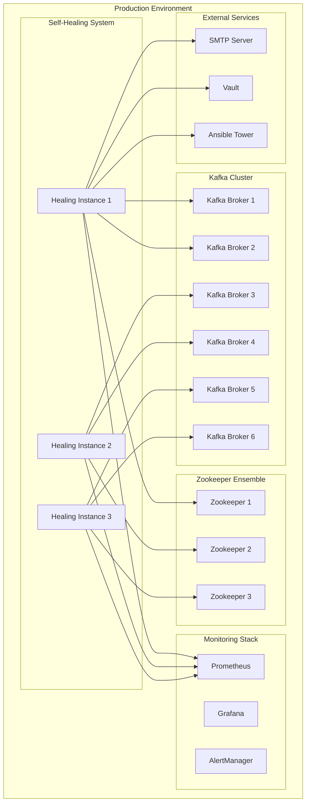
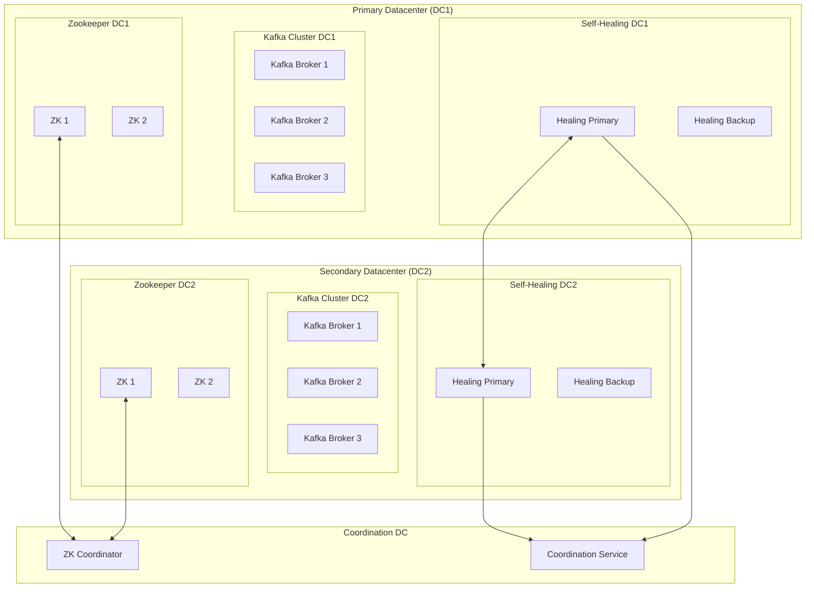

# Implementation Guide - Kafka Self-Healing System

This comprehensive implementation guide provides step-by-step instructions for deploying, configuring, and operating the Kafka Self-Healing system in production environments.

## Table of Contents

1. [Pre-Implementation Planning](#pre-implementation-planning)
2. [Environment Setup](#environment-setup)
3. [Installation and Deployment](#installation-and-deployment)
4. [Configuration Management](#configuration-management)
5. [Testing and Validation](#testing-and-validation)
6. [Production Deployment](#production-deployment)
7. [Monitoring and Operations](#monitoring-and-operations)
8. [Maintenance and Updates](#maintenance-and-updates)
9. [Performance Tuning](#performance-tuning)
10. [Troubleshooting Implementation Issues](#troubleshooting-implementation-issues)

## Pre-Implementation Planning

### Requirements Assessment

Before implementing the Kafka Self-Healing system, conduct a thorough assessment:

#### Infrastructure Requirements Checklist

```yaml
# Infrastructure Assessment Template
infrastructure_assessment:
  kafka_cluster:
    broker_count: 6
    zookeeper_count: 3
    version: "2.8.0"
    deployment_type: "bare_metal"  # or "kubernetes", "docker"
    
  network:
    monitoring_access: true
    jmx_ports_accessible: true
    smtp_connectivity: true
    dns_resolution: true
    
  security:
    ssl_enabled: true
    sasl_enabled: true
    rbac_required: true
    credential_management: "vault"
    
  monitoring:
    prometheus_available: true
    grafana_available: true
    log_aggregation: "elk"
    
  resources:
    cpu_cores: 4
    memory_gb: 8
    disk_space_gb: 100
    network_bandwidth: "1Gbps"
```

#### Capacity Planning

```python
# Capacity Planning Calculator
class CapacityPlanner:
    def __init__(self):
        self.base_requirements = {
            'cpu_cores': 2,
            'memory_mb': 512,
            'disk_gb': 10,
            'network_mbps': 100
        }
        
    def calculate_requirements(self, cluster_size, monitoring_frequency, features):
        """Calculate resource requirements based on cluster characteristics"""
        
        # Base scaling factors
        cpu_factor = 1 + (cluster_size * 0.1)  # 10% per additional node
        memory_factor = 1 + (cluster_size * 0.05)  # 5% per additional node
        
        # Monitoring frequency impact
        if monitoring_frequency < 30:
            cpu_factor *= 1.5
            memory_factor *= 1.2
            
        # Feature-based scaling
        if features.get('plugins_enabled'):
            cpu_factor *= 1.3
            memory_factor *= 1.4
            
        if features.get('high_availability'):
            cpu_factor *= 1.2
            memory_factor *= 1.3
            
        # Calculate final requirements
        requirements = {}
        for resource, base_value in self.base_requirements.items():
            if 'cpu' in resource:
                requirements[resource] = int(base_value * cpu_factor)
            elif 'memory' in resource:
                requirements[resource] = int(base_value * memory_factor)
            else:
                requirements[resource] = base_value
                
        return requirements

# Example usage
planner = CapacityPlanner()
requirements = planner.calculate_requirements(
    cluster_size=12,
    monitoring_frequency=15,
    features={
        'plugins_enabled': True,
        'high_availability': True,
        'multi_datacenter': False
    }
)
print(f"Recommended resources: {requirements}")
```

### Architecture Design

#### Single Datacenter Architecture



#### Multi-Datacenter Architecture



## Environment Setup

### Development Environment

```bash
#!/bin/bash
# Development environment setup script

# Create project directory
mkdir -p kafka-self-healing-dev
cd kafka-self-healing-dev

# Set up Python virtual environment
python3 -m venv venv
source venv/bin/activate

# Install dependencies
pip install -r requirements.txt
pip install -r requirements-dev.txt

# Set up Docker Compose for local testing
cat > docker-compose.yml << 'EOF'
version: '3.8'
services:
  zookeeper:
    image: confluentinc/cp-zookeeper:7.0.0
    environment:
      ZOOKEEPER_CLIENT_PORT: 2181
      ZOOKEEPER_TICK_TIME: 2000
    ports:
      - "2181:2181"

  kafka1:
    image: confluentinc/cp-kafka:7.0.0
    depends_on:
      - zookeeper
    ports:
      - "9092:9092"
      - "9999:9999"
    environment:
      KAFKA_BROKER_ID: 1
      KAFKA_ZOOKEEPER_CONNECT: zookeeper:2181
      KAFKA_ADVERTISED_LISTENERS: PLAINTEXT://localhost:9092
      KAFKA_OFFSETS_TOPIC_REPLICATION_FACTOR: 1
      KAFKA_JMX_PORT: 9999
      KAFKA_JMX_HOSTNAME: localhost

  kafka2:
    image: confluentinc/cp-kafka:7.0.0
    depends_on:
      - zookeeper
    ports:
      - "9093:9093"
      - "9998:9998"
    environment:
      KAFKA_BROKER_ID: 2
      KAFKA_ZOOKEEPER_CONNECT: zookeeper:2181
      KAFKA_ADVERTISED_LISTENERS: PLAINTEXT://localhost:9093
      KAFKA_OFFSETS_TOPIC_REPLICATION_FACTOR: 1
      KAFKA_JMX_PORT: 9998
      KAFKA_JMX_HOSTNAME: localhost

  prometheus:
    image: prom/prometheus:latest
    ports:
      - "9090:9090"
    volumes:
      - ./prometheus.yml:/etc/prometheus/prometheus.yml

  grafana:
    image: grafana/grafana:latest
    ports:
      - "3000:3000"
    environment:
      - GF_SECURITY_ADMIN_PASSWORD=admin

  mailhog:
    image: mailhog/mailhog:latest
    ports:
      - "1025:1025"
      - "8025:8025"
EOF

# Start development environment
docker-compose up -d

# Create development configuration
mkdir -p config
cat > config/development.yaml << 'EOF'
cluster:
  kafka_brokers:
    - node_id: kafka1
      host: localhost
      port: 9092
      jmx_port: 9999
    - node_id: kafka2
      host: localhost
      port: 9093
      jmx_port: 9998

  zookeeper_nodes:
    - node_id: zk1
      host: localhost
      port: 2181

monitoring:
  interval_seconds: 10
  timeout_seconds: 5
  methods: ["socket", "jmx"]

recovery:
  max_attempts: 2
  initial_delay_seconds: 5
  actions: ["restart_service"]

notifications:
  smtp:
    host: localhost
    port: 1025
    from_email: dev@localhost
    to_emails: ["admin@localhost"]

logging:
  level: DEBUG
  file: logs/development.log
EOF

echo "Development environment setup complete!"
echo "Access Grafana at http://localhost:3000 (admin/admin)"
echo "Access MailHog at http://localhost:8025"
echo "Kafka brokers available at localhost:9092 and localhost:9093"
```

### Staging Environment

```yaml
# Ansible playbook for staging environment setup
---
- name: Setup Kafka Self-Healing Staging Environment
  hosts: staging_servers
  become: yes
  vars:
    kafka_healing_version: "1.0.0"
    python_version: "3.9"
    
  tasks:
    - name: Install system dependencies
      package:
        name:
          - python3
          - python3-pip
          - python3-venv
          - git
          - curl
          - htop
        state: present
        
    - name: Create kafka-healing user
      user:
        name: kafka-healing
        system: yes
        shell: /bin/bash
        home: /opt/kafka-healing
        
    - name: Create application directories
      file:
        path: "{{ item }}"
        state: directory
        owner: kafka-healing
        group: kafka-healing
        mode: '0755'
      loop:
        - /opt/kafka-healing
        - /var/log/kafka-healing
        - /etc/kafka-healing
        - /opt/kafka-healing/plugins
        
    - name: Clone application repository
      git:
        repo: https://github.com/company/kafka-self-healing.git
        dest: /opt/kafka-healing/app
        version: "{{ kafka_healing_version }}"
      become_user: kafka-healing
      
    - name: Create Python virtual environment
      command: python3 -m venv /opt/kafka-healing/venv
      become_user: kafka-healing
      creates: /opt/kafka-healing/venv
      
    - name: Install Python dependencies
      pip:
        requirements: /opt/kafka-healing/app/requirements.txt
        virtualenv: /opt/kafka-healing/venv
      become_user: kafka-healing
      
    - name: Install application
      pip:
        name: /opt/kafka-healing/app
        virtualenv: /opt/kafka-healing/venv
        editable: yes
      become_user: kafka-healing
      
    - name: Copy configuration template
      template:
        src: staging_config.yaml.j2
        dest: /etc/kafka-healing/config.yaml
        owner: kafka-healing
        group: kafka-healing
        mode: '0600'
        
    - name: Create systemd service file
      template:
        src: kafka-healing.service.j2
        dest: /etc/systemd/system/kafka-healing.service
      notify: reload systemd
      
    - name: Create log rotation configuration
      template:
        src: logrotate.conf.j2
        dest: /etc/logrotate.d/kafka-healing
        
  handlers:
    - name: reload systemd
      systemd:
        daemon_reload: yes
```

## Installation and Deployment

### Package Installation

```bash
#!/bin/bash
# Production installation script

set -e

# Configuration
INSTALL_DIR="/opt/kafka-healing"
CONFIG_DIR="/etc/kafka-healing"
LOG_DIR="/var/log/kafka-healing"
USER="kafka-healing"
VERSION="1.0.0"

# Create user and directories
echo "Creating user and directories..."
useradd -r -s /bin/bash -d $INSTALL_DIR $USER
mkdir -p $INSTALL_DIR $CONFIG_DIR $LOG_DIR
chown -R $USER:$USER $INSTALL_DIR $LOG_DIR
chown root:$USER $CONFIG_DIR
chmod 750 $CONFIG_DIR

# Install system dependencies
echo "Installing system dependencies..."
if command -v apt-get &> /dev/null; then
    apt-get update
    apt-get install -y python3 python3-pip python3-venv git curl
elif command -v yum &> /dev/null; then
    yum install -y python3 python3-pip git curl
fi

# Install application
echo "Installing Kafka Self-Healing application..."
cd $INSTALL_DIR
sudo -u $USER python3 -m venv venv
sudo -u $USER ./venv/bin/pip install --upgrade pip

# Install from PyPI or local package
if [ -f "/tmp/kafka-self-healing-${VERSION}.tar.gz" ]; then
    sudo -u $USER ./venv/bin/pip install /tmp/kafka-self-healing-${VERSION}.tar.gz
else
    sudo -u $USER ./venv/bin/pip install kafka-self-healing==$VERSION
fi

# Create configuration template
cat > $CONFIG_DIR/config.yaml.template << 'EOF'
# Kafka Self-Healing Configuration Template
# Copy this file to config.yaml and customize for your environment

cluster:
  kafka_brokers:
    - node_id: "kafka-1"
      host: "kafka1.example.com"
      port: 9092
      jmx_port: 9999
    # Add more brokers as needed

  zookeeper_nodes:
    - node_id: "zk-1"
      host: "zk1.example.com"
      port: 2181
    # Add more zookeeper nodes as needed

monitoring:
  interval_seconds: 30
  timeout_seconds: 15
  methods: ["socket", "jmx"]

recovery:
  max_attempts: 3
  initial_delay_seconds: 10
  actions: ["restart_service"]

notifications:
  smtp:
    host: "smtp.example.com"
    port: 587
    username: "${SMTP_USERNAME}"
    password: "${SMTP_PASSWORD}"
    from_email: "kafka-alerts@example.com"
    to_emails:
      - "ops@example.com"

logging:
  level: INFO
  file: /var/log/kafka-healing/application.log
  max_size_mb: 100
  backup_count: 10
EOF

# Create systemd service
cat > /etc/systemd/system/kafka-healing.service << EOF
[Unit]
Description=Kafka Self-Healing System
After=network.target
Wants=network.target

[Service]
Type=simple
User=$USER
Group=$USER
WorkingDirectory=$INSTALL_DIR
Environment=PATH=$INSTALL_DIR/venv/bin
ExecStart=$INSTALL_DIR/venv/bin/python -m src.kafka_self_healing.main --config $CONFIG_DIR/config.yaml
Restart=always
RestartSec=10
StandardOutput=journal
StandardError=journal
SyslogIdentifier=kafka-healing

# Security settings
NoNewPrivileges=true
PrivateTmp=true
ProtectSystem=strict
ProtectHome=true
ReadWritePaths=$LOG_DIR $CONFIG_DIR

[Install]
WantedBy=multi-user.target
EOF

# Create log rotation
cat > /etc/logrotate.d/kafka-healing << 'EOF'
/var/log/kafka-healing/*.log {
    daily
    missingok
    rotate 30
    compress
    delaycompress
    notifempty
    create 644 kafka-healing kafka-healing
    postrotate
        systemctl reload kafka-healing || true
    endscript
}
EOF

# Set permissions
chown $USER:$USER $CONFIG_DIR/config.yaml.template
chmod 640 $CONFIG_DIR/config.yaml.template

# Enable service
systemctl daemon-reload
systemctl enable kafka-healing

echo "Installation complete!"
echo "1. Copy $CONFIG_DIR/config.yaml.template to $CONFIG_DIR/config.yaml"
echo "2. Edit $CONFIG_DIR/config.yaml with your environment settings"
echo "3. Set environment variables for sensitive data"
echo "4. Start the service with: systemctl start kafka-healing"
```

### Kubernetes Deployment

```yaml
# kubernetes/namespace.yaml
apiVersion: v1
kind: Namespace
metadata:
  name: kafka-healing
  labels:
    name: kafka-healing

---
# kubernetes/configmap.yaml
apiVersion: v1
kind: ConfigMap
metadata:
  name: kafka-healing-config
  namespace: kafka-healing
data:
  config.yaml: |
    cluster:
      kafka_brokers:
        - node_id: kafka-0
          host: kafka-0.kafka-headless.kafka.svc.cluster.local
          port: 9092
          jmx_port: 9999
        - node_id: kafka-1
          host: kafka-1.kafka-headless.kafka.svc.cluster.local
          port: 9092
          jmx_port: 9999
        - node_id: kafka-2
          host: kafka-2.kafka-headless.kafka.svc.cluster.local
          port: 9092
          jmx_port: 9999

      zookeeper_nodes:
        - node_id: zookeeper-0
          host: zookeeper-0.zookeeper-headless.kafka.svc.cluster.local
          port: 2181
        - node_id: zookeeper-1
          host: zookeeper-1.zookeeper-headless.kafka.svc.cluster.local
          port: 2181
        - node_id: zookeeper-2
          host: zookeeper-2.zookeeper-headless.kafka.svc.cluster.local
          port: 2181

    monitoring:
      interval_seconds: 20
      timeout_seconds: 15
      methods: ["socket", "jmx", "kubernetes"]

    recovery:
      max_attempts: 3
      initial_delay_seconds: 15
      actions: ["restart_pod", "scale_statefulset"]

    notifications:
      smtp:
        host: smtp.company.com
        port: 587
        username: ${SMTP_USERNAME}
        password: ${SMTP_PASSWORD}
        from_email: kafka-k8s@company.com
        to_emails:
          - k8s-ops@company.com

    logging:
      level: INFO
      file: /var/log/kafka-healing/application.log

    system:
      metrics:
        enabled: true
        port: 8080
        format: prometheus

---
# kubernetes/secret.yaml
apiVersion: v1
kind: Secret
metadata:
  name: kafka-healing-secrets
  namespace: kafka-healing
type: Opaque
data:
  smtp-username: <base64-encoded-username>
  smtp-password: <base64-encoded-password>

---
# kubernetes/rbac.yaml
apiVersion: v1
kind: ServiceAccount
metadata:
  name: kafka-healing
  namespace: kafka-healing

---
apiVersion: rbac.authorization.k8s.io/v1
kind: ClusterRole
metadata:
  name: kafka-healing-operator
rules:
- apiGroups: [""]
  resources: ["pods"]
  verbs: ["get", "list", "watch", "delete"]
- apiGroups: ["apps"]
  resources: ["statefulsets"]
  verbs: ["get", "list", "watch", "patch"]
- apiGroups: [""]
  resources: ["events"]
  verbs: ["create"]

---
apiVersion: rbac.authorization.k8s.io/v1
kind: ClusterRoleBinding
metadata:
  name: kafka-healing-operator
roleRef:
  apiGroup: rbac.authorization.k8s.io
  kind: ClusterRole
  name: kafka-healing-operator
subjects:
- kind: ServiceAccount
  name: kafka-healing
  namespace: kafka-healing

---
# kubernetes/deployment.yaml
apiVersion: apps/v1
kind: Deployment
metadata:
  name: kafka-healing
  namespace: kafka-healing
  labels:
    app: kafka-healing
spec:
  replicas: 2
  selector:
    matchLabels:
      app: kafka-healing
  template:
    metadata:
      labels:
        app: kafka-healing
    spec:
      serviceAccountName: kafka-healing
      containers:
      - name: kafka-healing
        image: kafka-self-healing:1.0.0
        ports:
        - containerPort: 8080
          name: metrics
        env:
        - name: CONFIG_PATH
          value: /config/config.yaml
        - name: SMTP_USERNAME
          valueFrom:
            secretKeyRef:
              name: kafka-healing-secrets
              key: smtp-username
        - name: SMTP_PASSWORD
          valueFrom:
            secretKeyRef:
              name: kafka-healing-secrets
              key: smtp-password
        volumeMounts:
        - name: config
          mountPath: /config
        - name: logs
          mountPath: /var/log/kafka-healing
        resources:
          requests:
            memory: "512Mi"
            cpu: "250m"
          limits:
            memory: "1Gi"
            cpu: "500m"
        livenessProbe:
          httpGet:
            path: /health
            port: 8080
          initialDelaySeconds: 30
          periodSeconds: 30
        readinessProbe:
          httpGet:
            path: /ready
            port: 8080
          initialDelaySeconds: 10
          periodSeconds: 10
      volumes:
      - name: config
        configMap:
          name: kafka-healing-config
      - name: logs
        emptyDir: {}

---
# kubernetes/service.yaml
apiVersion: v1
kind: Service
metadata:
  name: kafka-healing
  namespace: kafka-healing
  labels:
    app: kafka-healing
spec:
  selector:
    app: kafka-healing
  ports:
  - name: metrics
    port: 8080
    targetPort: 8080

---
# kubernetes/servicemonitor.yaml
apiVersion: monitoring.coreos.com/v1
kind: ServiceMonitor
metadata:
  name: kafka-healing
  namespace: kafka-healing
  labels:
    app: kafka-healing
spec:
  selector:
    matchLabels:
      app: kafka-healing
  endpoints:
  - port: metrics
    interval: 30s
    path: /metrics
```

## Configuration Management

### Environment-Specific Configuration

```python
# Configuration management system
class ConfigurationManager:
    def __init__(self, environment):
        self.environment = environment
        self.config_sources = [
            FileConfigSource(f"config/{environment}.yaml"),
            EnvironmentConfigSource(),
            VaultConfigSource() if environment == 'production' else None,
            ConsulConfigSource() if environment == 'production' else None
        ]
        self.config_sources = [s for s in self.config_sources if s is not None]
        
    def load_configuration(self):
        """Load configuration from multiple sources with precedence"""
        config = {}
        
        # Load from each source in order (later sources override earlier ones)
        for source in self.config_sources:
            try:
                source_config = source.load()
                config = self._deep_merge(config, source_config)
            except Exception as e:
                logger.error(f"Failed to load config from {source}: {e}")
                
        # Validate final configuration
        self._validate_configuration(config)
        
        return config
        
    def _deep_merge(self, base, override):
        """Deep merge two dictionaries"""
        result = base.copy()
        
        for key, value in override.items():
            if key in result and isinstance(result[key], dict) and isinstance(value, dict):
                result[key] = self._deep_merge(result[key], value)
            else:
                result[key] = value
                
        return result
        
    def _validate_configuration(self, config):
        """Validate configuration against schema"""
        validator = ConfigValidator()
        validation_result = validator.validate(config)
        
        if not validation_result.is_valid:
            raise ConfigurationError(f"Invalid configuration: {validation_result.errors}")

# Environment-specific configuration files
# config/development.yaml
development_config = """
cluster:
  kafka_brokers:
    - node_id: kafka1
      host: localhost
      port: 9092

monitoring:
  interval_seconds: 10
  timeout_seconds: 5

logging:
  level: DEBUG
  
notifications:
  smtp:
    host: localhost
    port: 1025
"""

# config/staging.yaml
staging_config = """
cluster:
  kafka_brokers:
    - node_id: kafka-staging-1
      host: kafka-staging-1.internal
      port: 9092
    - node_id: kafka-staging-2
      host: kafka-staging-2.internal
      port: 9092

monitoring:
  interval_seconds: 20
  timeout_seconds: 10

logging:
  level: INFO
  
security:
  ssl:
    enabled: true
"""

# config/production.yaml
production_config = """
cluster:
  kafka_brokers:
    - node_id: kafka-prod-1
      host: kafka-prod-1.company.com
      port: 9092
      jmx_port: 9999
    - node_id: kafka-prod-2
      host: kafka-prod-2.company.com
      port: 9092
      jmx_port: 9999

monitoring:
  interval_seconds: 30
  timeout_seconds: 15
  methods: ["socket", "jmx"]

recovery:
  max_attempts: 5
  actions: ["restart_service", "ansible"]

logging:
  level: INFO
  audit:
    enabled: true
    
security:
  ssl:
    enabled: true
  sasl:
    enabled: true
    
notifications:
  escalation:
    enabled: true
"""
```

### Configuration Validation

```python
# Configuration validation system
import jsonschema
from typing import Dict, List, Any

class ConfigValidator:
    def __init__(self):
        self.schema = self._load_schema()
        
    def _load_schema(self):
        """Load JSON schema for configuration validation"""
        return {
            "type": "object",
            "required": ["cluster", "monitoring", "recovery", "notifications"],
            "properties": {
                "cluster": {
                    "type": "object",
                    "required": ["kafka_brokers"],
                    "properties": {
                        "kafka_brokers": {
                            "type": "array",
                            "minItems": 1,
                            "items": {
                                "type": "object",
                                "required": ["node_id", "host", "port"],
                                "properties": {
                                    "node_id": {"type": "string"},
                                    "host": {"type": "string"},
                                    "port": {"type": "integer", "minimum": 1, "maximum": 65535},
                                    "jmx_port": {"type": "integer", "minimum": 1, "maximum": 65535}
                                }
                            }
                        },
                        "zookeeper_nodes": {
                            "type": "array",
                            "items": {
                                "type": "object",
                                "required": ["node_id", "host", "port"],
                                "properties": {
                                    "node_id": {"type": "string"},
                                    "host": {"type": "string"},
                                    "port": {"type": "integer", "minimum": 1, "maximum": 65535}
                                }
                            }
                        }
                    }
                },
                "monitoring": {
                    "type": "object",
                    "properties": {
                        "interval_seconds": {"type": "integer", "minimum": 5, "maximum": 3600},
                        "timeout_seconds": {"type": "integer", "minimum": 1, "maximum": 300},
                        "methods": {
                            "type": "array",
                            "items": {"type": "string", "enum": ["socket", "jmx", "zookeeper", "http"]}
                        }
                    }
                },
                "recovery": {
                    "type": "object",
                    "properties": {
                        "max_attempts": {"type": "integer", "minimum": 1, "maximum": 10},
                        "initial_delay_seconds": {"type": "integer", "minimum": 1},
                        "actions": {
                            "type": "array",
                            "items": {"type": "string"}
                        }
                    }
                },
                "notifications": {
                    "type": "object",
                    "properties": {
                        "smtp": {
                            "type": "object",
                            "required": ["host", "port", "from_email", "to_emails"],
                            "properties": {
                                "host": {"type": "string"},
                                "port": {"type": "integer", "minimum": 1, "maximum": 65535},
                                "from_email": {"type": "string", "format": "email"},
                                "to_emails": {
                                    "type": "array",
                                    "items": {"type": "string", "format": "email"}
                                }
                            }
                        }
                    }
                }
            }
        }
        
    def validate(self, config: Dict[str, Any]) -> ValidationResult:
        """Validate configuration against schema"""
        try:
            jsonschema.validate(config, self.schema)
            
            # Additional business logic validation
            business_errors = self._validate_business_rules(config)
            
            if business_errors:
                return ValidationResult(False, business_errors)
            else:
                return ValidationResult(True, [])
                
        except jsonschema.ValidationError as e:
            return ValidationResult(False, [str(e)])
            
    def _validate_business_rules(self, config: Dict[str, Any]) -> List[str]:
        """Validate business-specific rules"""
        errors = []
        
        # Check monitoring interval vs timeout
        monitoring = config.get('monitoring', {})
        interval = monitoring.get('interval_seconds', 30)
        timeout = monitoring.get('timeout_seconds', 15)
        
        if timeout >= interval:
            errors.append("Monitoring timeout must be less than interval")
            
        # Check Kafka broker count for production
        brokers = config.get('cluster', {}).get('kafka_brokers', [])
        if len(brokers) < 3 and config.get('environment') == 'production':
            errors.append("Production environment requires at least 3 Kafka brokers")
            
        # Check Zookeeper ensemble size
        zk_nodes = config.get('cluster', {}).get('zookeeper_nodes', [])
        if len(zk_nodes) % 2 == 0 and len(zk_nodes) > 0:
            errors.append("Zookeeper ensemble size should be odd number")
            
        return errors

class ValidationResult:
    def __init__(self, is_valid: bool, errors: List[str]):
        self.is_valid = is_valid
        self.errors = errors
```

## Testing and Validation

### Unit Testing Framework

```python
# Test framework for the self-healing system
import unittest
from unittest.mock import Mock, patch, AsyncMock
import asyncio
from src.kafka_self_healing.monitoring import MonitoringService
from src.kafka_self_healing.recovery import RecoveryEngine
from src.kafka_self_healing.models import NodeConfig, NodeStatus

class TestMonitoringService(unittest.TestCase):
    def setUp(self):
        self.config = {
            'monitoring': {
                'interval_seconds': 30,
                'timeout_seconds': 15,
                'methods': ['socket', 'jmx']
            }
        }
        self.monitoring_service = MonitoringService(self.config)
        
    @patch('src.kafka_self_healing.monitoring.socket.create_connection')
    def test_socket_monitoring_success(self, mock_socket):
        """Test successful socket monitoring"""
        mock_socket.return_value.__enter__.return_value = Mock()
        
        node_config = NodeConfig(
            node_id='test-kafka-1',
            node_type='kafka_broker',
            host='localhost',
            port=9092
        )
        
        result = asyncio.run(self.monitoring_service.check_socket_health(node_config))
        
        self.assertTrue(result.is_healthy)
        self.assertEqual(result.node_id, 'test-kafka-1')
        mock_socket.assert_called_once_with(('localhost', 9092), timeout=15)
        
    @patch('src.kafka_self_healing.monitoring.socket.create_connection')
    def test_socket_monitoring_failure(self, mock_socket):
        """Test socket monitoring failure"""
        mock_socket.side_effect = ConnectionRefusedError("Connection refused")
        
        node_config = NodeConfig(
            node_id='test-kafka-1',
            node_type='kafka_broker',
            host='localhost',
            port=9092
        )
        
        result = asyncio.run(self.monitoring_service.check_socket_health(node_config))
        
        self.assertFalse(result.is_healthy)
        self.assertIn("Connection refused", result.error_message)

class TestRecoveryEngine(unittest.TestCase):
    def setUp(self):
        self.config = {
            'recovery': {
                'max_attempts': 3,
                'initial_delay_seconds': 5,
                'actions': ['restart_service']
            }
        }
        self.recovery_engine = RecoveryEngine(self.config)
        
    @patch('subprocess.run')
    def test_service_restart_success(self, mock_subprocess):
        """Test successful service restart"""
        mock_subprocess.return_value.returncode = 0
        mock_subprocess.return_value.stdout = "Service restarted successfully"
        mock_subprocess.return_value.stderr = ""
        
        node_config = NodeConfig(
            node_id='test-kafka-1',
            node_type='kafka_broker',
            host='localhost',
            port=9092
        )
        
        result = asyncio.run(self.recovery_engine.restart_service(node_config))
        
        self.assertTrue(result.success)
        self.assertEqual(result.exit_code, 0)
        
    @patch('subprocess.run')
    def test_service_restart_failure(self, mock_subprocess):
        """Test service restart failure"""
        mock_subprocess.return_value.returncode = 1
        mock_subprocess.return_value.stdout = ""
        mock_subprocess.return_value.stderr = "Service restart failed"
        
        node_config = NodeConfig(
            node_id='test-kafka-1',
            node_type='kafka_broker',
            host='localhost',
            port=9092
        )
        
        result = asyncio.run(self.recovery_engine.restart_service(node_config))
        
        self.assertFalse(result.success)
        self.assertEqual(result.exit_code, 1)
        self.assertIn("Service restart failed", result.stderr)

# Integration test suite
class TestIntegration(unittest.TestCase):
    @classmethod
    def setUpClass(cls):
        """Set up test environment"""
        cls.test_config = {
            'cluster': {
                'kafka_brokers': [
                    {
                        'node_id': 'test-kafka-1',
                        'host': 'localhost',
                        'port': 9092,
                        'jmx_port': 9999
                    }
                ],
                'zookeeper_nodes': [
                    {
                        'node_id': 'test-zk-1',
                        'host': 'localhost',
                        'port': 2181
                    }
                ]
            },
            'monitoring': {
                'interval_seconds': 10,
                'timeout_seconds': 5,
                'methods': ['socket']
            },
            'recovery': {
                'max_attempts': 2,
                'initial_delay_seconds': 1,
                'actions': ['restart_service']
            },
            'notifications': {
                'smtp': {
                    'host': 'localhost',
                    'port': 1025,
                    'from_email': 'test@localhost',
                    'to_emails': ['admin@localhost']
                }
            }
        }
        
    def test_end_to_end_monitoring_and_recovery(self):
        """Test complete monitoring and recovery flow"""
        from src.kafka_self_healing.main import SelfHealingSystem
        
        system = SelfHealingSystem(self.test_config)
        
        # Start system
        asyncio.run(system.start())
        
        # Wait for monitoring cycle
        time.sleep(15)
        
        # Check that monitoring is working
        self.assertTrue(system.monitoring_service.is_running)
        
        # Stop system
        asyncio.run(system.stop())

# Performance test suite
class TestPerformance(unittest.TestCase):
    def test_monitoring_performance(self):
        """Test monitoring performance under load"""
        import time
        
        config = {
            'monitoring': {
                'interval_seconds': 1,
                'timeout_seconds': 0.5,
                'methods': ['socket']
            }
        }
        
        monitoring_service = MonitoringService(config)
        
        # Create multiple node configurations
        nodes = [
            NodeConfig(f'kafka-{i}', 'kafka_broker', 'localhost', 9092 + i)
            for i in range(10)
        ]
        
        # Measure monitoring time
        start_time = time.time()
        
        results = []
        for node in nodes:
            result = asyncio.run(monitoring_service.check_socket_health(node))
            results.append(result)
            
        end_time = time.time()
        
        # Assert performance requirements
        total_time = end_time - start_time
        self.assertLess(total_time, 10.0, "Monitoring 10 nodes should take less than 10 seconds")
        
        # Check that all results are present
        self.assertEqual(len(results), 10)

if __name__ == '__main__':
    # Run all tests
    unittest.main()
```

### Integration Testing

```bash
#!/bin/bash
# Integration test script

set -e

echo "Starting integration tests..."

# Start test environment
echo "Starting test environment..."
docker-compose -f docker-compose.test.yml up -d

# Wait for services to be ready
echo "Waiting for services to be ready..."
sleep 30

# Check Kafka is accessible
echo "Testing Kafka connectivity..."
kafka-topics.sh --bootstrap-server localhost:9092 --list

# Check Zookeeper is accessible
echo "Testing Zookeeper connectivity..."
echo "ruok" | nc localhost 2181

# Run integration tests
echo "Running integration tests..."
python -m pytest tests/integration/ -v

# Run end-to-end tests
echo "Running end-to-end tests..."
python tests/test_e2e.py

# Run performance tests
echo "Running performance tests..."
python tests/benchmark.py

# Cleanup
echo "Cleaning up test environment..."
docker-compose -f docker-compose.test.yml down

echo "Integration tests completed successfully!"
```

This implementation guide provides comprehensive, step-by-step instructions for deploying and operating the Kafka Self-Healing system in production environments. Each section includes practical examples, scripts, and configurations that can be directly used in real deployments.