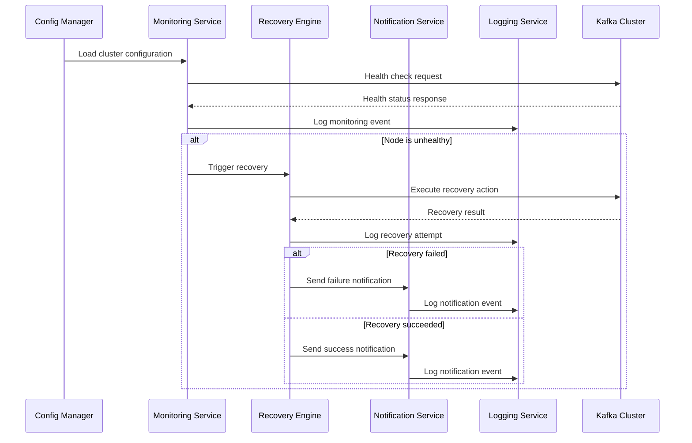

# Senior Engineer Guide - Kafka Self-Healing System

This comprehensive guide is designed for senior engineers who need to understand, deploy, operate, and extend the Kafka Self-Healing system in production environments.

## Table of Contents

1. [System Architecture Deep Dive](#system-architecture-deep-dive)
2. [Real-Time Production Scenarios](#real-time-production-scenarios)
3. [Advanced Configuration Patterns](#advanced-configuration-patterns)
4. [Performance Optimization](#performance-optimization)
5. [Security Hardening](#security-hardening)
6. [Monitoring and Observability](#monitoring-and-observability)
7. [Disaster Recovery](#disaster-recovery)
8. [Scaling and High Availability](#scaling-and-high-availability)
9. [Integration Patterns](#integration-patterns)
10. [Troubleshooting Complex Issues](#troubleshooting-complex-issues)

## System Architecture Deep Dive

### Core Design Principles

The Kafka Self-Healing system is built on several key architectural principles:

1. **Event-Driven Architecture**: All components communicate through well-defined events
2. **Plugin-Based Extensibility**: Core functionality can be extended without modifying base code
3. **Fail-Safe Operations**: System continues operating even when individual components fail
4. **Comprehensive Observability**: Every action is logged and can be monitored
5. **Configuration-Driven Behavior**: All behavior is configurable without code changes

### Component Interaction Flow



### Memory and Resource Management

```python
# Example of resource-aware monitoring
class ResourceAwareMonitoringService:
    def __init__(self, config):
        self.max_concurrent_checks = config.get('max_concurrent_operations', 10)
        self.memory_threshold = config.get('memory_limit_mb', 512) * 1024 * 1024
        self.semaphore = asyncio.Semaphore(self.max_concurrent_checks)
        
    async def monitor_with_resource_control(self, nodes):
        # Check memory usage before starting new operations
        if self._get_memory_usage() > self.memory_threshold:
            await self._cleanup_old_data()
            
        # Use semaphore to limit concurrent operations
        async with self.semaphore:
            return await self._perform_health_check(nodes)
```

## Real-Time Production Scenarios

### Scenario 1: Kafka Broker Cascade Failure

**Situation**: Multiple Kafka brokers fail simultaneously due to network partition.

**System Response**:
```yaml
# Configuration for handling cascade failures
recovery:
  cascade_failure_detection:
    enabled: true
    threshold_percentage: 50  # If >50% of brokers fail
    response_strategy: "conservative"
    
  conservative_recovery:
    sequential_recovery: true  # Recover one broker at a time
    inter_recovery_delay: 120  # Wait 2 minutes between recoveries
    validation_timeout: 300    # Wait 5 minutes to validate recovery
```

**Real-Time Actions**:
1. **T+0s**: System detects first broker failure
2. **T+30s**: Second broker failure detected
3. **T+45s**: Third broker failure triggers cascade detection
4. **T+60s**: System switches to conservative recovery mode
5. **T+90s**: Begins sequential recovery of brokers
6. **T+5m**: First broker recovered and validated
7. **T+7m**: Second broker recovery initiated

**Senior Engineer Intervention Points**:
- Monitor cluster partition tolerance
- Validate ISR (In-Sync Replica) status
- Check for data consistency issues
- Coordinate with network team if needed

### Scenario 2: Zookeeper Quorum Loss

**Situation**: Zookeeper ensemble loses quorum due to hardware failures.

**System Response**:
```yaml
# Zookeeper-specific recovery configuration
recovery:
  zookeeper:
    quorum_loss_detection: true
    emergency_procedures:
      - "stop_kafka_brokers"      # Prevent split-brain
      - "backup_zk_data"          # Backup current state
      - "restore_zk_quorum"       # Restore quorum
      - "validate_cluster_state"  # Verify consistency
      - "restart_kafka_brokers"   # Resume operations
```

**Critical Decision Points**:
1. **Immediate**: Stop all Kafka brokers to prevent data corruption
2. **Within 5 minutes**: Assess Zookeeper data integrity
3. **Within 15 minutes**: Restore quorum or initiate manual recovery
4. **Within 30 minutes**: Validate cluster state before resuming operations

### Scenario 3: High-Throughput Cluster Under Load

**Situation**: Production cluster handling 1M+ messages/second experiences intermittent broker issues.

**Optimized Configuration**:
```yaml
monitoring:
  high_throughput_mode:
    enabled: true
    interval_seconds: 15        # Faster monitoring
    concurrent_checks: true     # Parallel health checks
    adaptive_timeouts: true     # Adjust based on load
    
  load_aware_thresholds:
    cpu_threshold: 85           # Higher CPU tolerance
    memory_threshold: 90        # Higher memory tolerance
    network_latency_ms: 100     # Account for network load
    
recovery:
  load_sensitive_recovery:
    check_cluster_load: true    # Check load before recovery
    graceful_recovery: true     # Minimize impact on throughput
    load_threshold: 80          # Don't recover if load >80%
```

**Performance Monitoring**:
```python
# Real-time performance tracking
class PerformanceAwareRecovery:
    def should_attempt_recovery(self, node, cluster_metrics):
        current_load = cluster_metrics.get_cluster_load()
        if current_load > self.load_threshold:
            self.logger.info(f"Delaying recovery due to high load: {current_load}%")
            return False
            
        partition_count = cluster_metrics.get_under_replicated_partitions()
        if partition_count > self.partition_threshold:
            self.logger.warning(f"Critical partition state, forcing recovery")
            return True
            
        return True
```

### Scenario 4: Multi-Datacenter Failover

**Situation**: Primary datacenter experiences complete network isolation.

**Cross-DC Configuration**:
```yaml
multi_datacenter:
  failover:
    automatic: false            # Require manual approval
    detection_threshold: 300    # 5 minutes of isolation
    validation_checks:
      - "network_connectivity"
      - "data_replication_lag"
      - "consumer_group_state"
    
  coordination:
    primary_dc: "us-east-1"
    secondary_dc: "us-west-2"
    coordination_service: "consul"  # For distributed coordination
    
notifications:
  escalation:
    datacenter_failure:
      immediate: ["cto@company.com", "vp-engineering@company.com"]
      sms: ["+1-555-EMERGENCY"]
      pagerduty: "critical-infrastructure"
```

**Failover Decision Matrix**:
| Condition | Action | Approval Required |
|-----------|--------|-------------------|
| Network partition <5min | Monitor only | No |
| Network partition >5min | Prepare failover | Yes |
| Data loss risk | Immediate failover | CTO approval |
| Consumer lag >1hr | Gradual failover | Engineering VP |

## Advanced Configuration Patterns

### Environment-Specific Configuration Inheritance

```yaml
# base.yaml - Common configuration
base_config: &base
  monitoring:
    interval_seconds: 30
    timeout_seconds: 15
  recovery:
    max_attempts: 3
  logging:
    level: INFO

# production.yaml - Production overrides
production:
  <<: *base
  monitoring:
    <<: *base.monitoring
    interval_seconds: 15      # Faster monitoring in prod
    health_check_retries: 3   # More retries in prod
  security:
    ssl:
      enabled: true
      verify_certificates: true
  notifications:
    escalation:
      enabled: true
      escalation_delay: 300
```

### Dynamic Configuration Updates

```python
# Hot configuration reloading
class ConfigurationWatcher:
    def __init__(self, config_path, reload_callback):
        self.config_path = config_path
        self.reload_callback = reload_callback
        self.last_modified = os.path.getmtime(config_path)
        
    async def watch_for_changes(self):
        while True:
            current_modified = os.path.getmtime(self.config_path)
            if current_modified > self.last_modified:
                try:
                    new_config = self._load_config()
                    await self.reload_callback(new_config)
                    self.last_modified = current_modified
                    logger.info("Configuration reloaded successfully")
                except Exception as e:
                    logger.error(f"Failed to reload configuration: {e}")
            
            await asyncio.sleep(30)  # Check every 30 seconds
```

### Plugin Configuration Patterns

```yaml
plugins:
  monitoring_plugins:
    prometheus_monitoring:
      enabled: true
      priority: 1
      config:
        prometheus_url: "http://prometheus:9090"
        custom_queries:
          kafka_lag: |
            sum(kafka_consumer_lag_sum{topic=~"important-.*"}) by (consumer_group)
          broker_health: |
            up{job="kafka-broker"} == 1
        alert_thresholds:
          lag_threshold: 10000
          health_threshold: 0.8
          
    custom_jmx_monitoring:
      enabled: true
      priority: 2
      config:
        jmx_metrics:
          - "kafka.server:type=BrokerTopicMetrics,name=MessagesInPerSec"
          - "kafka.server:type=BrokerTopicMetrics,name=BytesInPerSec"
          - "kafka.server:type=ReplicaManager,name=LeaderCount"
        thresholds:
          messages_per_sec_min: 100
          leader_count_min: 1
```

## Performance Optimization

### Monitoring Performance Tuning

```python
# Optimized monitoring with connection pooling
class OptimizedMonitoringService:
    def __init__(self, config):
        self.connection_pool = {}
        self.metrics_cache = TTLCache(maxsize=1000, ttl=30)
        
    async def check_node_health_optimized(self, node):
        # Reuse connections where possible
        connection_key = f"{node.host}:{node.port}"
        if connection_key not in self.connection_pool:
            self.connection_pool[connection_key] = await self._create_connection(node)
            
        # Use cached metrics if available
        cache_key = f"{node.node_id}:health"
        if cache_key in self.metrics_cache:
            return self.metrics_cache[cache_key]
            
        # Perform actual health check
        result = await self._perform_health_check(node, self.connection_pool[connection_key])
        self.metrics_cache[cache_key] = result
        return result
```

### Memory-Efficient Logging

```python
# Structured logging with memory management
class MemoryEfficientLogger:
    def __init__(self, max_memory_mb=100):
        self.max_memory = max_memory_mb * 1024 * 1024
        self.log_buffer = deque(maxlen=10000)  # Circular buffer
        self.compression_enabled = True
        
    def log_event(self, event_data):
        # Compress large log entries
        if len(str(event_data)) > 1024 and self.compression_enabled:
            event_data = self._compress_log_data(event_data)
            
        self.log_buffer.append({
            'timestamp': time.time(),
            'data': event_data,
            'compressed': self.compression_enabled
        })
        
        # Check memory usage periodically
        if len(self.log_buffer) % 1000 == 0:
            self._check_memory_usage()
```

### Concurrent Recovery Optimization

```python
# Intelligent recovery scheduling
class ConcurrentRecoveryManager:
    def __init__(self, max_concurrent=3):
        self.max_concurrent = max_concurrent
        self.recovery_semaphore = asyncio.Semaphore(max_concurrent)
        self.recovery_queue = PriorityQueue()
        
    async def schedule_recovery(self, node, failure_type, priority=1):
        recovery_task = RecoveryTask(node, failure_type, priority)
        await self.recovery_queue.put((priority, recovery_task))
        
    async def process_recovery_queue(self):
        while True:
            try:
                priority, task = await self.recovery_queue.get()
                async with self.recovery_semaphore:
                    await self._execute_recovery_with_coordination(task)
            except Exception as e:
                logger.error(f"Recovery processing error: {e}")
```

## Security Hardening

### Credential Management Best Practices

```python
# Secure credential handling
class SecureCredentialManager:
    def __init__(self, config):
        self.vault_client = self._initialize_vault_client(config)
        self.credential_cache = {}
        self.cache_ttl = 300  # 5 minutes
        
    async def get_credential(self, credential_path):
        # Check cache first
        cache_key = f"{credential_path}:{int(time.time() // self.cache_ttl)}"
        if cache_key in self.credential_cache:
            return self.credential_cache[cache_key]
            
        # Fetch from vault
        credential = await self.vault_client.get_secret(credential_path)
        self.credential_cache[cache_key] = credential
        
        # Clean old cache entries
        self._cleanup_expired_cache()
        return credential
        
    def _cleanup_expired_cache(self):
        current_window = int(time.time() // self.cache_ttl)
        expired_keys = [k for k in self.credential_cache.keys() 
                       if not k.endswith(str(current_window))]
        for key in expired_keys:
            del self.credential_cache[key]
```

### Network Security Configuration

```yaml
security:
  network:
    # TLS configuration
    tls:
      min_version: "1.2"
      cipher_suites:
        - "ECDHE-RSA-AES256-GCM-SHA384"
        - "ECDHE-RSA-AES128-GCM-SHA256"
      certificate_validation: "strict"
      
    # Network access control
    access_control:
      allowed_networks:
        - "10.0.0.0/8"
        - "172.16.0.0/12"
        - "192.168.0.0/16"
      denied_networks:
        - "0.0.0.0/0"  # Deny all by default
        
    # Rate limiting
    rate_limiting:
      enabled: true
      requests_per_minute: 1000
      burst_size: 100
      
  # Audit and compliance
  audit:
    log_all_access: true
    log_failed_attempts: true
    retention_days: 365
    encryption_at_rest: true
```

### RBAC Integration

```python
# Role-based access control
class RBACManager:
    def __init__(self, config):
        self.roles = config.get('rbac', {}).get('roles', {})
        self.permissions = config.get('rbac', {}).get('permissions', {})
        
    def check_permission(self, user, action, resource):
        user_roles = self._get_user_roles(user)
        required_permission = f"{action}:{resource}"
        
        for role in user_roles:
            role_permissions = self.permissions.get(role, [])
            if required_permission in role_permissions or "*:*" in role_permissions:
                return True
                
        return False
        
    def audit_access_attempt(self, user, action, resource, granted):
        audit_event = {
            'timestamp': datetime.utcnow().isoformat(),
            'user': user,
            'action': action,
            'resource': resource,
            'granted': granted,
            'source_ip': self._get_source_ip()
        }
        self.audit_logger.info(json.dumps(audit_event))
```

## Monitoring and Observability

### Comprehensive Metrics Collection

```python
# Prometheus metrics integration
from prometheus_client import Counter, Histogram, Gauge, start_http_server

class MetricsCollector:
    def __init__(self):
        # Monitoring metrics
        self.health_checks_total = Counter('kafka_healing_health_checks_total', 
                                         'Total health checks performed', 
                                         ['node_id', 'node_type', 'method'])
        
        self.health_check_duration = Histogram('kafka_healing_health_check_duration_seconds',
                                             'Health check duration',
                                             ['node_id', 'method'])
        
        # Recovery metrics
        self.recovery_attempts_total = Counter('kafka_healing_recovery_attempts_total',
                                             'Total recovery attempts',
                                             ['node_id', 'action_type'])
        
        self.recovery_success_total = Counter('kafka_healing_recovery_success_total',
                                            'Successful recoveries',
                                            ['node_id', 'action_type'])
        
        # System metrics
        self.active_monitors = Gauge('kafka_healing_active_monitors',
                                   'Number of active monitoring threads')
        
        self.memory_usage_bytes = Gauge('kafka_healing_memory_usage_bytes',
                                      'Memory usage in bytes')
        
    def record_health_check(self, node_id, node_type, method, duration, success):
        self.health_checks_total.labels(node_id=node_id, 
                                      node_type=node_type, 
                                      method=method).inc()
        
        self.health_check_duration.labels(node_id=node_id, 
                                         method=method).observe(duration)
        
    def record_recovery_attempt(self, node_id, action_type, success):
        self.recovery_attempts_total.labels(node_id=node_id, 
                                          action_type=action_type).inc()
        
        if success:
            self.recovery_success_total.labels(node_id=node_id, 
                                             action_type=action_type).inc()
```

### Distributed Tracing

```python
# OpenTelemetry integration
from opentelemetry import trace
from opentelemetry.exporter.jaeger.thrift import JaegerExporter
from opentelemetry.sdk.trace import TracerProvider
from opentelemetry.sdk.trace.export import BatchSpanProcessor

class DistributedTracing:
    def __init__(self, service_name="kafka-self-healing"):
        trace.set_tracer_provider(TracerProvider())
        tracer = trace.get_tracer(__name__)
        
        jaeger_exporter = JaegerExporter(
            agent_host_name="jaeger",
            agent_port=6831,
        )
        
        span_processor = BatchSpanProcessor(jaeger_exporter)
        trace.get_tracer_provider().add_span_processor(span_processor)
        
        self.tracer = tracer
        
    def trace_monitoring_operation(self, node_id, method):
        return self.tracer.start_as_current_span(
            f"monitor_node",
            attributes={
                "node.id": node_id,
                "monitoring.method": method,
                "service.name": "kafka-self-healing"
            }
        )
        
    def trace_recovery_operation(self, node_id, action_type):
        return self.tracer.start_as_current_span(
            f"recover_node",
            attributes={
                "node.id": node_id,
                "recovery.action": action_type,
                "service.name": "kafka-self-healing"
            }
        )
```

### Custom Dashboards

```yaml
# Grafana dashboard configuration
dashboards:
  kafka_self_healing_overview:
    panels:
      - title: "Cluster Health Status"
        type: "stat"
        targets:
          - expr: "up{job='kafka-self-healing'}"
            legendFormat: "System Status"
            
      - title: "Health Check Success Rate"
        type: "stat"
        targets:
          - expr: "rate(kafka_healing_health_checks_total[5m])"
            legendFormat: "Checks/sec"
            
      - title: "Recovery Success Rate"
        type: "graph"
        targets:
          - expr: "rate(kafka_healing_recovery_success_total[5m]) / rate(kafka_healing_recovery_attempts_total[5m])"
            legendFormat: "Success Rate"
            
      - title: "Node Status Heatmap"
        type: "heatmap"
        targets:
          - expr: "kafka_healing_node_health_status"
            legendFormat: "{{node_id}}"
            
  alerts:
    - alert: "KafkaHealingSystemDown"
      expr: "up{job='kafka-self-healing'} == 0"
      for: "1m"
      annotations:
        summary: "Kafka Self-Healing system is down"
        
    - alert: "HighRecoveryFailureRate"
      expr: "rate(kafka_healing_recovery_success_total[5m]) / rate(kafka_healing_recovery_attempts_total[5m]) < 0.8"
      for: "5m"
      annotations:
        summary: "High recovery failure rate detected"
```

## Disaster Recovery

### Backup and Restore Procedures

```python
# Automated backup system
class DisasterRecoveryManager:
    def __init__(self, config):
        self.backup_config = config.get('disaster_recovery', {})
        self.backup_storage = self._initialize_backup_storage()
        
    async def create_system_backup(self):
        backup_data = {
            'timestamp': datetime.utcnow().isoformat(),
            'configuration': await self._backup_configuration(),
            'recovery_history': await self._backup_recovery_history(),
            'plugin_state': await self._backup_plugin_state(),
            'metrics_snapshot': await self._backup_metrics()
        }
        
        backup_id = f"backup_{int(time.time())}"
        await self.backup_storage.store(backup_id, backup_data)
        
        # Cleanup old backups
        await self._cleanup_old_backups()
        
        return backup_id
        
    async def restore_from_backup(self, backup_id):
        backup_data = await self.backup_storage.retrieve(backup_id)
        
        # Restore configuration
        await self._restore_configuration(backup_data['configuration'])
        
        # Restore recovery history
        await self._restore_recovery_history(backup_data['recovery_history'])
        
        # Restore plugin state
        await self._restore_plugin_state(backup_data['plugin_state'])
        
        logger.info(f"System restored from backup {backup_id}")
```

### Failover Automation

```yaml
# Disaster recovery configuration
disaster_recovery:
  backup:
    enabled: true
    schedule: "0 2 * * *"  # Daily at 2 AM
    retention_days: 30
    storage:
      type: "s3"
      bucket: "kafka-healing-backups"
      encryption: true
      
  failover:
    enabled: true
    detection:
      health_check_failures: 5
      consecutive_failures: 3
      timeout_seconds: 300
      
    automation:
      auto_failover: false  # Require manual approval
      notification_channels:
        - "pagerduty"
        - "slack"
        - "email"
        
    recovery:
      auto_recovery: true
      recovery_delay_minutes: 10
      validation_timeout_minutes: 30
```

## Scaling and High Availability

### Horizontal Scaling Architecture

```python
# Leader election for HA deployment
class LeaderElection:
    def __init__(self, config):
        self.node_id = config.get('node_id', socket.gethostname())
        self.etcd_client = etcd3.client(host=config.get('etcd_host'))
        self.lease_ttl = config.get('lease_ttl', 30)
        self.is_leader = False
        
    async def participate_in_election(self):
        while True:
            try:
                # Try to acquire leadership
                lease = self.etcd_client.lease(self.lease_ttl)
                success = self.etcd_client.transaction(
                    compare=[self.etcd_client.transactions.create('/leader') == 0],
                    success=[self.etcd_client.transactions.put('/leader', self.node_id, lease)],
                    failure=[]
                )
                
                if success:
                    self.is_leader = True
                    logger.info(f"Node {self.node_id} became leader")
                    await self._run_as_leader(lease)
                else:
                    self.is_leader = False
                    await self._run_as_follower()
                    
            except Exception as e:
                logger.error(f"Leader election error: {e}")
                await asyncio.sleep(5)
                
    async def _run_as_leader(self, lease):
        try:
            while True:
                # Renew lease
                lease.refresh()
                
                # Perform leader duties
                await self._coordinate_monitoring()
                await self._manage_recovery_queue()
                
                await asyncio.sleep(10)
                
        except Exception as e:
            logger.error(f"Leader operation error: {e}")
            self.is_leader = False
```

### Load Balancing and Distribution

```yaml
# HA configuration
high_availability:
  enabled: true
  
  cluster:
    nodes:
      - id: "node-1"
        host: "kafka-healing-1"
        port: 8080
        weight: 100
        
      - id: "node-2"
        host: "kafka-healing-2"
        port: 8080
        weight: 100
        
      - id: "node-3"
        host: "kafka-healing-3"
        port: 8080
        weight: 50  # Lower capacity node
        
  load_balancing:
    strategy: "weighted_round_robin"
    health_check_interval: 30
    failure_threshold: 3
    
  coordination:
    backend: "etcd"
    endpoints:
      - "etcd-1:2379"
      - "etcd-2:2379"
      - "etcd-3:2379"
    
  data_distribution:
    partition_strategy: "consistent_hashing"
    replication_factor: 2
    sync_interval: 60
```

## Integration Patterns

### CI/CD Integration

```yaml
# .github/workflows/deploy-kafka-healing.yml
name: Deploy Kafka Self-Healing System

on:
  push:
    branches: [main]
    paths: ['src/**', 'config/**']

jobs:
  test:
    runs-on: ubuntu-latest
    steps:
      - uses: actions/checkout@v2
      
      - name: Set up Python
        uses: actions/setup-python@v2
        with:
          python-version: 3.9
          
      - name: Install dependencies
        run: |
          pip install -r requirements.txt
          pip install -r requirements-test.txt
          
      - name: Run tests
        run: |
          pytest tests/ --cov=src --cov-report=xml
          
      - name: Security scan
        run: |
          bandit -r src/
          safety check
          
  deploy:
    needs: test
    runs-on: ubuntu-latest
    if: github.ref == 'refs/heads/main'
    
    steps:
      - name: Deploy to staging
        run: |
          ansible-playbook -i inventory/staging deploy.yml
          
      - name: Run integration tests
        run: |
          pytest tests/integration/ --env=staging
          
      - name: Deploy to production
        if: success()
        run: |
          ansible-playbook -i inventory/production deploy.yml
```

### Kubernetes Operator Pattern

```python
# Kubernetes operator for managing Kafka Self-Healing
import kopf
from kubernetes import client, config

@kopf.on.create('kafkahealing.io', 'v1', 'kafkahealers')
async def create_kafka_healer(spec, name, namespace, **kwargs):
    # Create ConfigMap for configuration
    config_map = client.V1ConfigMap(
        metadata=client.V1ObjectMeta(name=f"{name}-config"),
        data={'config.yaml': yaml.dump(spec.get('config', {}))}
    )
    
    # Create Deployment
    deployment = client.V1Deployment(
        metadata=client.V1ObjectMeta(name=name),
        spec=client.V1DeploymentSpec(
            replicas=spec.get('replicas', 1),
            selector=client.V1LabelSelector(
                match_labels={'app': name}
            ),
            template=client.V1PodTemplateSpec(
                metadata=client.V1ObjectMeta(labels={'app': name}),
                spec=client.V1PodSpec(
                    containers=[
                        client.V1Container(
                            name='kafka-healer',
                            image=spec.get('image', 'kafka-self-healing:latest'),
                            env=[
                                client.V1EnvVar(name='CONFIG_PATH', value='/config/config.yaml')
                            ],
                            volume_mounts=[
                                client.V1VolumeMount(
                                    name='config',
                                    mount_path='/config'
                                )
                            ]
                        )
                    ],
                    volumes=[
                        client.V1Volume(
                            name='config',
                            config_map=client.V1ConfigMapVolumeSource(
                                name=f"{name}-config"
                            )
                        )
                    ]
                )
            )
        )
    )
    
    # Apply resources
    v1 = client.CoreV1Api()
    apps_v1 = client.AppsV1Api()
    
    v1.create_namespaced_config_map(namespace, config_map)
    apps_v1.create_namespaced_deployment(namespace, deployment)
    
    return {'message': f'Kafka Healer {name} created successfully'}
```

### Service Mesh Integration

```yaml
# Istio service mesh configuration
apiVersion: networking.istio.io/v1beta1
kind: VirtualService
metadata:
  name: kafka-healing-vs
spec:
  hosts:
  - kafka-healing
  http:
  - match:
    - headers:
        x-user-role:
          exact: admin
    route:
    - destination:
        host: kafka-healing
        subset: admin
  - route:
    - destination:
        host: kafka-healing
        subset: readonly
        
---
apiVersion: networking.istio.io/v1beta1
kind: DestinationRule
metadata:
  name: kafka-healing-dr
spec:
  host: kafka-healing
  trafficPolicy:
    tls:
      mode: ISTIO_MUTUAL
  subsets:
  - name: admin
    labels:
      version: v1
    trafficPolicy:
      connectionPool:
        tcp:
          maxConnections: 100
  - name: readonly
    labels:
      version: v1
    trafficPolicy:
      connectionPool:
        tcp:
          maxConnections: 50
```

## Troubleshooting Complex Issues

### Advanced Debugging Techniques

```python
# Debug mode with enhanced logging
class AdvancedDebugger:
    def __init__(self, config):
        self.debug_enabled = config.get('debug_mode', False)
        self.trace_enabled = config.get('trace_mode', False)
        self.profiling_enabled = config.get('profiling_enabled', False)
        
    def debug_monitoring_flow(self, node_config):
        if not self.debug_enabled:
            return
            
        debug_info = {
            'node_config': asdict(node_config),
            'system_state': self._capture_system_state(),
            'network_diagnostics': self._run_network_diagnostics(node_config),
            'resource_usage': self._capture_resource_usage()
        }
        
        logger.debug(f"Monitoring debug info: {json.dumps(debug_info, indent=2)}")
        
    def _run_network_diagnostics(self, node_config):
        diagnostics = {}
        
        # Test DNS resolution
        try:
            socket.gethostbyname(node_config.host)
            diagnostics['dns_resolution'] = 'success'
        except socket.gaierror as e:
            diagnostics['dns_resolution'] = f'failed: {e}'
            
        # Test TCP connectivity
        try:
            sock = socket.create_connection((node_config.host, node_config.port), timeout=5)
            sock.close()
            diagnostics['tcp_connectivity'] = 'success'
        except Exception as e:
            diagnostics['tcp_connectivity'] = f'failed: {e}'
            
        # Test SSL/TLS if enabled
        if hasattr(node_config, 'ssl_enabled') and node_config.ssl_enabled:
            try:
                context = ssl.create_default_context()
                with socket.create_connection((node_config.host, node_config.port)) as sock:
                    with context.wrap_socket(sock, server_hostname=node_config.host) as ssock:
                        diagnostics['ssl_handshake'] = 'success'
            except Exception as e:
                diagnostics['ssl_handshake'] = f'failed: {e}'
                
        return diagnostics
```

### Performance Profiling

```python
# Performance profiling tools
import cProfile
import pstats
from memory_profiler import profile

class PerformanceProfiler:
    def __init__(self):
        self.profiler = cProfile.Profile()
        self.profiling_active = False
        
    def start_profiling(self):
        if not self.profiling_active:
            self.profiler.enable()
            self.profiling_active = True
            
    def stop_profiling(self, output_file=None):
        if self.profiling_active:
            self.profiler.disable()
            self.profiling_active = False
            
            if output_file:
                self.profiler.dump_stats(output_file)
            else:
                stats = pstats.Stats(self.profiler)
                stats.sort_stats('cumulative')
                stats.print_stats(20)  # Top 20 functions
                
    @profile  # Memory profiling decorator
    def profile_memory_usage(self, func, *args, **kwargs):
        return func(*args, **kwargs)
```

### Root Cause Analysis Framework

```python
# Automated root cause analysis
class RootCauseAnalyzer:
    def __init__(self):
        self.analysis_rules = [
            self._check_network_issues,
            self._check_resource_constraints,
            self._check_configuration_issues,
            self._check_external_dependencies,
            self._check_timing_issues
        ]
        
    async def analyze_failure(self, failure_event):
        analysis_results = []
        
        for rule in self.analysis_rules:
            try:
                result = await rule(failure_event)
                if result:
                    analysis_results.append(result)
            except Exception as e:
                logger.error(f"Analysis rule failed: {e}")
                
        # Rank results by confidence
        ranked_results = sorted(analysis_results, 
                              key=lambda x: x.get('confidence', 0), 
                              reverse=True)
        
        return {
            'primary_cause': ranked_results[0] if ranked_results else None,
            'contributing_factors': ranked_results[1:],
            'recommendations': self._generate_recommendations(ranked_results)
        }
        
    async def _check_network_issues(self, failure_event):
        # Check for network-related failure patterns
        if 'timeout' in failure_event.error_message.lower():
            return {
                'cause': 'network_timeout',
                'confidence': 0.8,
                'evidence': failure_event.error_message,
                'recommendation': 'Check network connectivity and firewall rules'
            }
        return None
```

This comprehensive guide provides senior engineers with the deep technical knowledge needed to successfully deploy, operate, and extend the Kafka Self-Healing system in production environments. Each section includes practical examples, real-world scenarios, and advanced techniques for handling complex situations.